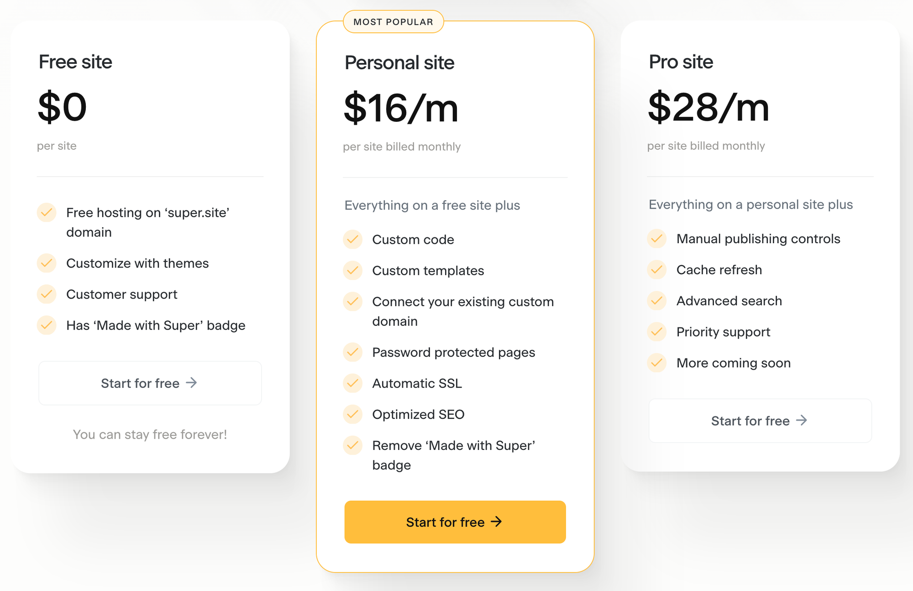
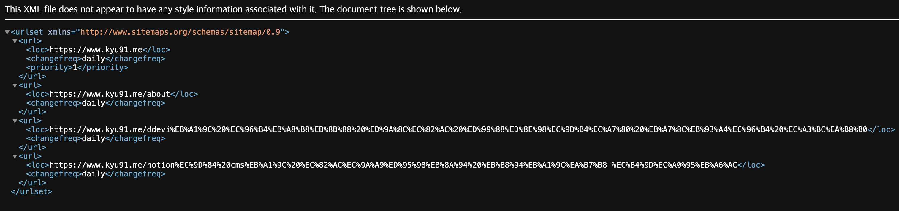

- 길었던 그동안의 삽질을 뒤로하고 oopy에 돈을 써보자
<!-- more -->
## 개요

### Next.js로 notion cms 블로그 만들기 포기한 이유

우선 하기 북마크는 내가 Notion 을 CMS로 사용하는 블로그를 만들기 위해 무엇을 했는지 정리가 되어있다.

[Notion을 CMS로 사용하는 블로그-총정리](https://www.kyu91.me/e6eedb9f-b521-434e-9917-eca30c1f03a3)

`문제점`이 하나 있었는데, 해당 Github 소스는 동적으로 sitemap을 만들고 이전 sitemap과 비교하여 새로 생긴 것이 있다면, 웹에 로드해주는 방식을 하고 있다. 

>[!tip]
>즉, 페이지가 많아지면 많아질 수록 불러와야 하는 sitemap은 많아지고 로드하는데 시간이 오래 걸린다.

이점을 해결하기 위해 sitemap을 동적으로 만들어주는 코드를 최적화 하는 작업도 진행 했지만 실패했다. 너무 하위 페이지들이 많았기 때문이다. 

그렇다고 sitemap을 안쓰면 내가 새로 작성한 노션의 글이 업로드가 되지 않았다. 

해당 문제를 결국 해결을 하지 못하고 난 돈을 쓰기로 했다.

## 후보군

### 1. Vercel Pro 사용

[nextjs-notion-starter-kit](https://github.com/transitive-bullshit/nextjs-notion-starter-kit)의 Issues 에서도 나와 동일한 문제를 호소하는 사람들이 있었고 그들은 해결방법으로 Vercel Pro를 사용 하는 방법으로 해결했다고 했다. (얼탱이 없음)

해당 비용은 월 20$… 바로 포기했다.

### 2. super.so

[Super — Create Websites with Notion](https://super.so/)

해외의 oopy라고 생각하면 쉽다. 

무료로도 사용이 가능하다! 하지만 커스텀 도메인을 사용하기 위해선 유로 플랜을 사용해야 하고 그 가격은 다음과 같다. 월 16$ → 포기

### 3. oopy.io

[1분 만에 만드는 노션 웹사이트, 우피!](https://www.oopy.io/)

무료체험 기간이 있긴 하지만 기본으로 유료이다. 

하지만 기본 플랜이 매우 저렴하고 다른 우피 사용자 도메인을 입력하면 1개월 50% 할인도 해준다. 

[가격 안내](https://www.oopy.io/ko/pricing)

- 플랜별 가격
    - 베이직 플랜: 5,900원
    - 프로 플랜: 9,900원

베이직과 프로의 차이점은 GNB 메뉴를 구성 할 수 있는 점과 페이지별 유저 트래킹을 지원해주는 점 인 것으로 확인 했다. (Pageview referrer의 정확한 기능은 파악하지 못하여서 확인 필요!)

기본 플랜에서도 커스텀 도메인을 사용 할 수 있으므로 oopy로 선택 했다.

## 지금까지 후기

### 장점

1. 자잘한 오류가 없다
    
    생각보다 자잘한 오류가 없었고, 홈페이지가 조금 느리긴 하지만 안정적으로 돌아가는게 마음에 들었다. 
    
2. HTML / CSS 커스텀
    
    베이직 플랜에서 된다는게 대박이라고 생각한다. HTML 블록을 노션에 넣어 커스텀 할 수 있고, 자체 에디터에서 넣을 수 도 있다. 
    
3. 베이직에서 지원되는 너무 많은 편의 기능
    
    너무 찬양하는 것 같긴 한데, 베이직만 해도 oopy의 99%기능을 모두 활용 할 수 있다고 말할 수 있다. 
    
    특히 개인적으로 “이걸 베이직에서?”하는 기능을 고른다면,
    
    - 커스텀 도메인 + 리다이랙트 주소 설정
    - CTA 버튼 생성 + 트레킹
    - 노션 데이터 베이스 뷰어 설정
    - `head`, `body` 커스텀
    - 편리한 플러그인 설정
    - 그외 등등
4. 싸다

### 단점

- 느린편
    - 방문했던 페이지는 캐싱하여 재방문 시 금방 로드 되지만 처음 방문하는 페이지는 많이 느리다고 체감이 되었다.
- sitemap.xml 자동 생성 안됨
    - 이부분이 가장 큰 단점으로 왔다.
    - 물론 `클린URL` 이라는 기능을 사용하며, 내 노션 페이지를 등록 해두면 해당 페이지가 sitemap으로 등록이 되었다.
        - 등록한 클린 URL 목록
            
            
            
        - sitemap.xml
            
            
            

## 결론

계속 사용 할 것 같다. 

>[!tip]
>개발(코딩)을 모르더라도 사용 할 수 있고, 개발에 대한 지식이 조금이라도 있다면, 몇배 더 잘 사용 할 수 있는 플랫폼이다.

1인 개발자로 시작한 플랫폼이라고 하는데, 정말 존경 스럽다. 

혹시나 인터뷰할 일이 생긴다면 어떤식으로 그렇게 빠르게 노션 페이지를 불러 올 수 있는지 물어보고 싶다. 원리가 궁금하다.

oopy 사장님 저 열심히 썼는데, 쿠폰 하나 주세요.