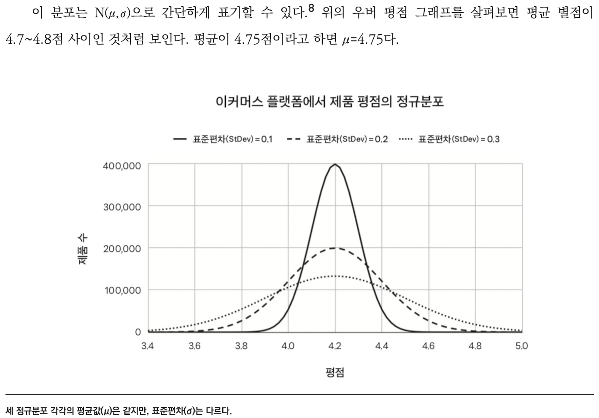

- 363 ~ 375p 20장 끝까지

<!-- more -->

>[!tip]
>7가지 코드 - 닐 메타, 아디티야 아가쉐, 파스 디트로자 지음

# PM의 데이터

# 요약

- PM에게 데이터를 분석하고 관찰하는 것은 중요한 역량이다. 
- 데이터의 가장 유명한 형태는 종형곡선, 가우스분포 라고 불리는 **정규분포**(Normal distribution)이다. 하나의 평균값에 모여있고 그 평균값에서 양방향으로 멀어질 수 록 하락하는 데이터 확산을 나타낸다.
- 평균값과 표준편차라는 두 변수, 즉 두 파라미터를 활용하여 정규분포의 형태를 말할 수 있다.
    - 이커머스 플랫폼에서 제품 평점의 정규분포
        
        
        
- 비대칭분포일때는 평균이 늘 유용한 지표가 되는 경우가 아니다. 중앙 값이 더 유용하다.
    - 시나 웨이보 사용자의 팔로워 수 분포
        
        
        
- 멱함수 분포는 순위를 정할때 많이 나타나는 분포인다.
    - 미국 최상위 웹사이트 트래픽 분포
        
        
        
- 고래형태는 80/20 규칙 또는 파레터 법칙이다. 이 규칙은 80%행동이 20%의 행위자에게서 나온다는 것을 의미한다.

# 교훈 및 적용

- 데이터에 많이 약하다. 꾸준히 주별로 계획을 잡고 진행 해야 겠다.