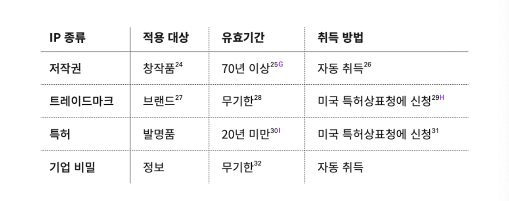

- 484 ~ 493p 링크세 전 까지

<!-- more -->

>[!tip]
>7가지 코드 - 닐 메타, 아디티야 아가쉐, 파스 디트로자 지음

# IP 보호

# 요약

- 테크 기업은 지식재산 즉, IP를 중요하게 생각하며, PM은 이를 관리 할 수 있어야 한다.
- IP의 종류는 저작권, 트레이드마크, 특허, 기업비밀이 있다. PM은 저작권과 특허가 가장 관련이 있다.
- 저작권은 소프트웨어부터 포스팅, 음악에 이르기 까지 창작물을 보호한다. 저작권은 ‘제품’에 적용되며, 트레이드마크와 서비스마크는 ‘브랜드’에 적용된다. 미국 특허상표청(USPTO)에 트레이드마크를 등록하면 TM 마크를 R 로 업그레이드 할 수 있다.
- 특허와 기업 비밀 사이에는 분명한 트레이드 오프가 있다. 특허는 독점 권한을 보유하며 다른 회사에서 사용할 때 수수료를 받는다. 기업 비밀은 말그대로 아예 비밀로 감추는 것이다. 코카콜라 레시비, KFC 튀김옷 같은 것이 있다. 특허를 받으려면 모든 내용을 공개 해야 하기 때문이다. 
이러한 특허나 기업비밀은 테크 기없에서도 있다. 구글 검색 알고리즘과 자율주행 알고리즘 같은 것들이다.
- 위 네가지의 비교 표
    
    
    
- 테크기업에서 특허는 공격적 특허와 방어적 특허라는 두가지 전략이 있다. 공격적 특허는 우리가 알고 있는 특허 전략이며, 방어적 특허는 다른 사람이 특허를 내지 못하도록 하는 것이다. 이러한 방어적 특허는 특허괴물때문에 주로 사용한다.

# 교훈 및 적용

- 저작권 트레이드마크, 특허, 기업비밀을 적적히 제품에 적용 하도록 해보자