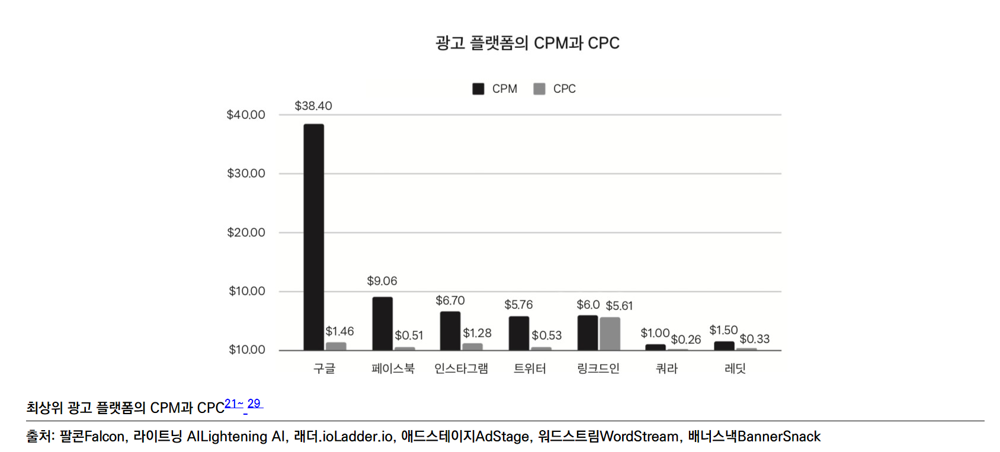

- 589 ~ 600p 그로스해킹 전까지

<!-- more -->

>[!tip]
>7가지 코드 - 닐 메타, 아디티야 아가쉐, 파스 디트로자 지음

# 마케팅

# 요약

- CPM(조회수 1천 회 당 과금), CPC(클릭당 과금), CTR(클릭률)이라는 측정법을 알아야 한다. 구글 광고는 CPI(설치당 과금)도 많이 사용한다. CPM 을 더 정확히 말하자면 CPV(조회당 과금)으로 판매된다.
- 업체별 CPM과 CPC
    
    
    
- 퍼널에서 새어나간 사람들을 다시 데려오는 전략으로 리타게팅과 리마케팅이 있다.
- 퍼널 + 리타게팅 + 리마케팅
    
    
    

# 교훈 및 적용

마케팅에 대해 좀더 근본적으로 공부를 해야 겠다.