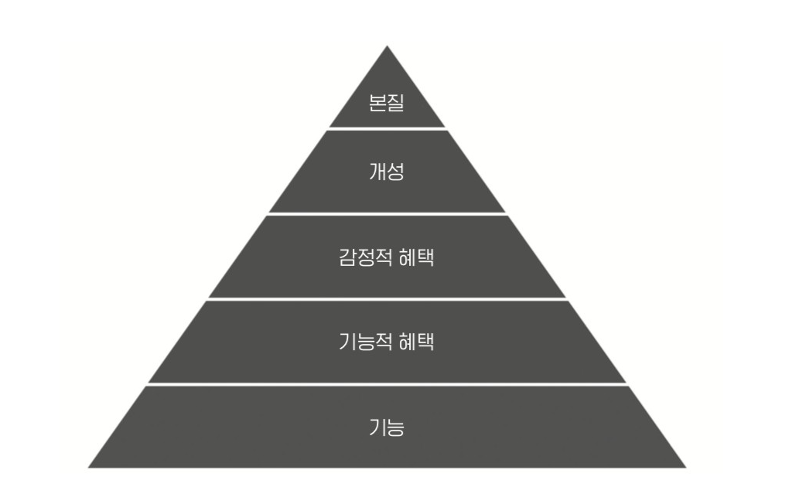

- 561 ~ 575p 토끼: 1000달러 전까지

<!-- more -->

>[!tip]
>7가지 코드 - 닐 메타, 아디티야 아가쉐, 파스 디트로자 지음

# 사냥모델

# 요약

- 브랜딩에는 제품이 불러일으키는 감정적 혜택, 제품이 수행할 보다 광범위한 사회적 임무이다.
- 브랜딩 피라미드는 다음과 같이 구성된다.
1. 기능과 속성: 제품이 하는 일
2. 기능적 혜택: 사용자의 문제를 해결하는 제품의 기능
3. 감정적 혜택: 제품이 사람들에게 선사하는 느낌
4. 브랜드 개성: 사용자와 감정적 유대감을 쌓기 위해 사용되는 제품의 인간적인 특징
5. 브랜드 본질: 제품이나 회사가 수행할 보다 광범위한 임
- 피라미드 그림
    
    
    
- 테슬라의 브랜드 피라미드
    
    
    

---

- 영업담당자들에게 사냥 모델이라고 불리는 이것은 ‘연간 고객 1명당 벌어드리고자 하는 매출의 평균, 즉 ARPA(계정당 연간 매출)를 기준’으로 회사를 분류한다.
- 사냥모델 그래프
    
    
    
- 파리 : 10달러씩
    - 한 명 당 10달러씩 벌어서 1억달러를 벌기 위해선 1000만명의 사용자에게 벌면 된다. 사용자 1명을 더 획득하기 위해 자용하는 CAC가 사용자가 소비할 금액 LTV를 초과하면 안 된다. 즉, 파리를 대상으로 하는 마케팅과 광고에는 큰 비용을 사용 할 수 없다.
    - 그래서 바이럴 성장 마케팅이나 UGC 방식이 활용된다.
    - 바이럴 그로우스 마케팅은 사용자의 네트워크 효과로 마케팅이 되도록 기획 하는 것이다. UGC는 유저가 직접 만든 콘탠츠를 통해 SEO기술로 많은 사람들에게 검색 되게 해야 한다.
- 쥐 : 100달러씩
    - 대부분 구독 서비스로 수익을 낸다.
    - ARPU는 모든 사용자의 평균 매출이지만, ARPPU는 유료 사용자만 고려 한다.

# 교훈 및 적용

- 사냥 모델이 매우 흥미롭다. 내 제품을 어떤 사냥 모델에 적용 할 수 있을지 고민해보자