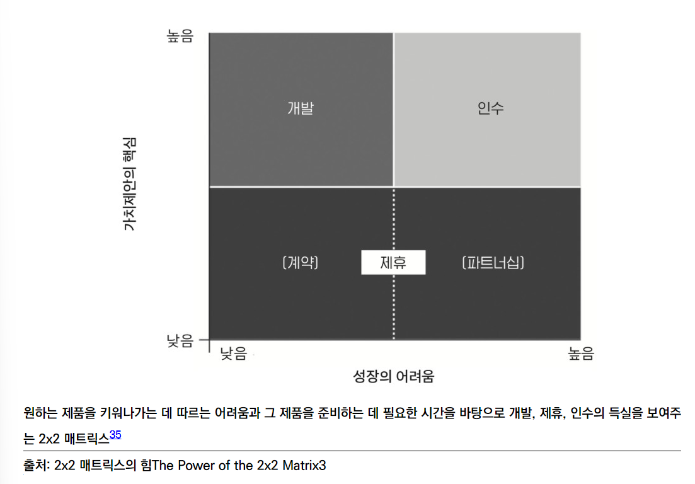

- 121~ 129p 7장 해자 끝까지

<!-- more -->

>[!tip]
>7가지 코드 - 닐 메타, 아디티야 아가쉐, 파스 디트로자 지음

# 해자를 구축하여 침입을 막자

# 요약

- 논의되고 있는 제품이 가치제안의 핵심이 아닐 경우에는 그 제품을 빌려오는 게 좋다.
    - 개발, 제휴, 인수의 득실 비교 그래프
        
        
        
        
        

---

- 시장 진입 후 그 시장을 지키기 위해  경제적 해자로 침입을 막아야 한다. 이것은 **진입장벽**과 **전환장벽**이다.
- 진입장벽이 높은 사업은 많은 비용이 필요하거나 인프라가 필요한 사업이 있고 이런 것을 **자연독점** 이라고 한다. 이것의 반대되는 예로 클라우드 컴퓨팅이 발달 되어서 IT 산업의 진입 장벽이 낮아진 케이스가 있다.  
- 그외 규제(제약 유통)나 지식재산(특허)같은 사업이 있다.
- 전환장벽의 큰 예는 전환비용이 있고 이것의 가장 적절한 기업은 애플이다. 또한 커뮤니티(SNS)와 브랜드 충성도, 네트워크 효과도 같은 경우 이다. 
네트워크 효과는 양면시장(저자는 아마존, 에어비앤비, 우버를 사용했으나 당근도 비슷하다)에서 큰 힘을 발휘한다.

# 교훈 및 적용

- 해자는 한마디로 비용이다. 이 비용은 실제 돈이 될 수도 있고 시간, 충성도가 있다. 사용자를 매몰시키는 방법에 대해 정리했고 이부분을 적용해 보자. 근데, 이번 장은 너무 당연한 내용들이고 상세한 방법이 없는 것이 조금 아쉽다.