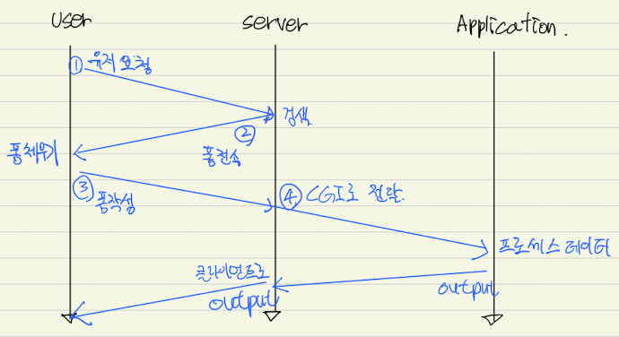
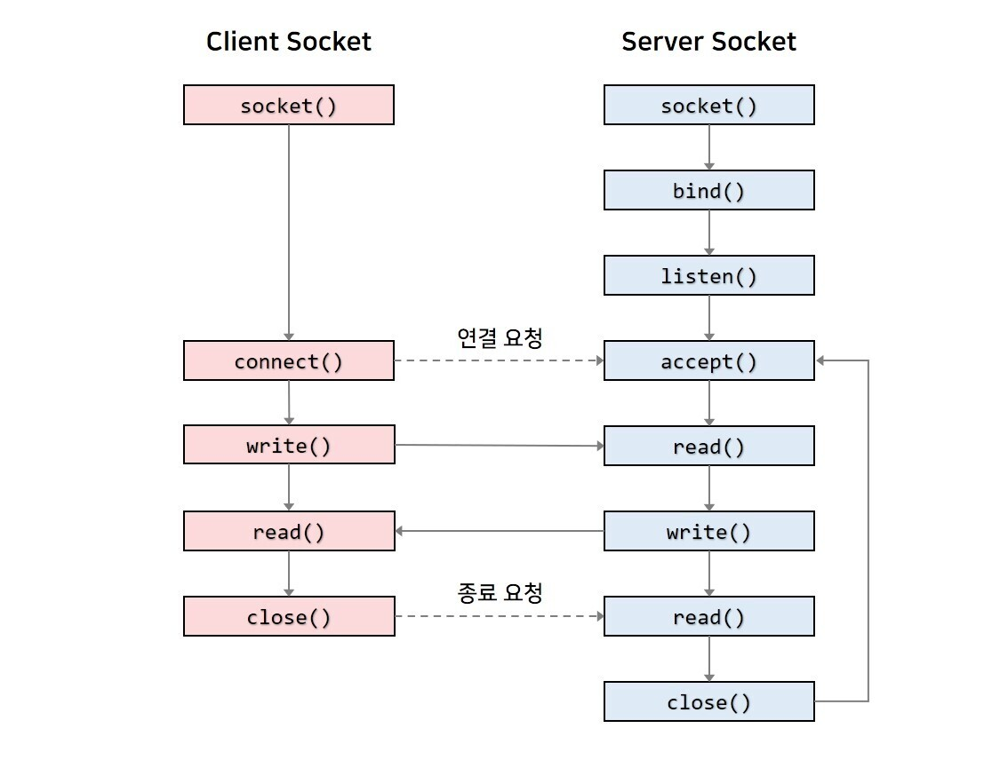

- SW사관학교 정글 5기 7주차 회고
<!-- more -->

해당 내용은 정확하지 않아 개발 공부에 도움이 되지 않습니다.

귀한 시간 내주시어 지적해 주시면 감사 드리겠습니다.

---

## **Tiny서버**

1) CGI

- 서버와 어플리케이션 간에 데이터를 주고 받는 방식, 또는 컨벤션



2) 소켓

- 데이터를 보내거나 받을때 창구 역할을 한다.
- 데이터 송신의 Abstraction



3) 라우팅과 라우트

    - 라우트는 경로, 라우팅은 그 경로를 찾아가기 위한 과정

4) Tiny 서버에서 사용되는 함수 정리

    - strlen() : 문자열 길이를 반환한다.
    - open() : std input, std output, std err 파일을 기본적으로 열어 줄 수 있다.
    - close() : file descriptor(fd)를 받아 닫는다.
    - Read() : 읽은 바이트의 크기를 리턴
    - write() : 쓴 바이트 수를 리턴
    - mmap() : fd로 지정된 디바이스 파일에서 offset에 해당하는 물리주소에서 시작하여, length바이트 만큼을 start주소로 대응
    - strcasecmp() : 대소문자를 구별하지 않고 스트링을 비교 해준다.

```c
/* $begin tinymain */
/*
 * tiny.c - A simple, iterative HTTP/1.0 Web server that uses the
 *     GET method to serve static and dynamic content.
 *
 * Updated 11/2019 droh
 *   - Fixed sprintf() aliasing issue in serve_static(), and clienterror().
 */
#include "csapp.h"

void doit(int fd);
void read_requesthdrs(rio_t *rp);
int parse_uri(char *uri, char *filename, char *cgiargs);
void serve_static(int fd, char *filename, int filesize, char *method);
void get_filetype(char *filename, char *filetype);
void serve_dynamic(int fd, char *filename, char *cgiargs, char *method);
void clienterror(int fd, char *cause, char *errnum, char *shortmsg,
                 char *longmsg);

/*doit, 한 개의 HTTP 트랜잭션을 처리한다.*/
void doit(int fd)// fd = file descriptor = 파일 식별자
{
  int is_static;
  struct stat sbuf;
  /*MAXLINE : 8192, 2^23, 8kbyte*/
  char buf[MAXLINE], method[MAXLINE], uri[MAXLINE], version[MAXLINE];
  char filename[MAXLINE], cgiargs[MAXLINE];
  rio_t rio;

  /* Read request line and headers*/
  Rio_readinitb(&rio, fd);
  Rio_readlineb(&rio, buf, MAXLINE);    // 요청라인을 읽고 분석

  printf("Request headers: \\n");
  printf("%s", buf);
  sscanf(buf, "%s %s %s", method, uri, version);
  if (!(strcasecmp(method, "GET") == 0 || strcasecmp(method, "HEAD") == 0))        // POST만 받을꺼야
  {
    clienterror(fd, method, "501", "Not impemented",
                "Tiny does not implement this method");
    return;
  }
  read_requesthdrs(&rio);               // POST면 무시

  /*Parse URI from GET request*/
  is_static = parse_uri(uri, filename, cgiargs);    // 정적인지 동적인지(정적이면 참?)
  if (stat(filename, &sbuf) < 0)                    // 디스크에 파일이 없다면 리턴
  {
    clienterror(fd, filename, "404", "Not found",
                "Tiny dees not implement this method");
    return;
  }

  if (is_static)      //Serve static content
  {
    if(!(S_ISREG(sbuf.st_mode)) || !(S_IRUSR & sbuf.st_mode))//보통 파일이 아니면서 GET 권한을 가지고 있지 않는
    {
      clienterror(fd, filename, "403", "Forbidden", "Tiny couldn't read the file");
      return;
    }
    serve_static(fd, filename, sbuf.st_size, method);     // 다 참이면 정적 주셈
  }
  else                // Serve dynamic content
  {
    if (!(S_ISREG(sbuf.st_mode)) || !(S_IXUSR & sbuf.st_mode))//보통 파일이 아니면서 POST 권한을 가지고 있지 않는
    {
      clienterror(fd, filename, "403", "Forbidden", "Tiny couldn't run the CGI program");
      return;
    }
    serve_dynamic(fd, filename, cgiargs, method);       // 다 참이면 동적 주셈
  }

}

/*에러 처리 함수*/
void clienterror(int fd, char *cause, char *errnum, char *shortmsg, char *longmsg)
{
  //MAXBUF : 8192
  char buf[MAXLINE], body[MAXBUF];

  /*Build the HTTP response body*/
  sprintf(body, "<html><title>Tiny Error</title>");
  sprintf(body, "%s<body bgcolor=""ffffff"">\\r\\n" , body);
  sprintf(body, "%s%s: %s\\r\\n", body, errnum, shortmsg);
  sprintf(body, "%s<p>%s: %s\\r\\n", body, longmsg, cause);
  sprintf(body, "%s<hr><em>The tiny Web server</em>\\r\\n", body);

  /*Print the HTTP response*/
  sprintf(buf, "HTTP/1.0 %s %s\\r\\n", errnum, shortmsg);
  Rio_writen(fd, buf, strlen(buf));
  sprintf(buf, "Content-type: text/html\\r\\n");
  Rio_writen(fd, buf, strlen(buf));
  sprintf(buf, "Content-length: %d\\r\\n\\r\\n", (int)strlen(body));
  Rio_writen(fd, buf, strlen(buf));
  Rio_writen(fd, body, strlen(body));
}

/*요청헤더 내 정보를 읽고 무시한다?*/
void read_requesthdrs(rio_t *rp)
{
  char buf[MAXLINE];

  Rio_readlineb(rp, buf, MAXLINE);
  while(strcmp(buf, "\\r\\n"))
  {
    rio_readlineb(rp, buf, MAXLINE);
    printf("%s", buf);
  }
  return;
}

/*HTTP URI를 분석한다. */
int parse_uri(char *uri, char *filename, char *cgiargs)
{
  char *ptr;

  if (!strstr(uri, "cgi-bin")) //static content
  {
    strcpy(cgiargs, "");    // cgi인자 스트링을 지우고
    strcpy(filename, ".");  // URIfmf ./index.html 같은 상대 리눅스 경로이름으로 변환
    strcat(filename, uri);  // 까지
    if (uri[strlen(uri)-1] == '/')  //만약에 uri가 /로 끝난다면
      strcat(filename, "home.html");  // 기본 파일 이름을 추가
    return 1;
  }
  else                          //Dynamic content
  {
    ptr = index(uri, '?');    // 동적이라면
    if (ptr)
    {
      strcpy(cgiargs, ptr+1); // CGI 모든 인자를 추출
      *ptr = '\\0';
    }
    else
      strcpy(cgiargs, "");    // 까지

    strcpy(filename, ".");    // 나머지 URI 부분을 상대 리눅스 파일 이름으로 변환
    strcat(filename, uri);    // 까지
    return 0;
  }
}

/*정적 컨텐츠를 클라이언트에게 제공*/
void serve_static(int fd, char *filename, int filesize, char *method)
{
  int srcfd;
  char *srcp, filetype[MAXLINE], buf[MAXBUF];

  /*Send response headers to client*/
  get_filetype(filename, filetype);                         //파일의 접미어 부분을 검사해 파일 타입을 결정
  sprintf(buf, "HTTP/1.0 200 OK\\r\\n");                      //클라이언트에 응답줄과 응답헤더를 보낸다
  sprintf(buf, "%sServer: Tiny Web Server\\r\\n", buf);
  sprintf(buf, "%sConnection: close\\r\\n", buf);
  sprintf(buf, "%sContent-length: %d\\r\\n", buf, filesize);
  sprintf(buf, "%sContent-type: %s\\r\\n\\r\\n", buf, filetype);
  Rio_writen(fd, buf, strlen(buf));                         //까지,
  printf("Response headers: \\n");
  printf("%s", buf);                                        //헤더 종료

  /*
  Send response body to client
  요청한 파일의 내용을 연결 식별자 fd로 복사해서 응답 본체를 보낸다.
  */
  if (strcasecmp(method, "GET") == 0)
  {
    srcfd = Open(filename, O_RDONLY, 0);    //읽기위해서 filename을 오픈하고 식별자를 얻어옴
    // srcp = Mmap(0, filesize, PROT_READ, MAP_PRIVATE, srcfd, 0); //리눅스mmap함수를 요청한 파일을 가상메모리 영역으로 매핑
    // Close(srcfd);                           //파일을 메모리로 맵핑한 후 이 식별자는 필요 없어 닫는다.(메모리 누수 방지)
    // Rio_writen(fd, srcp, filesize);         //실제로 파일을 클라이언트에 전송(주소 srcp에서 시작하는 filesize바이트를 클라이언트의 연결식별자로 복사)
    // Munmap(srcp, filesize);                 //맵핑된 가상 메모리 주소를 반환(메모리 누수 방지)

    /*mmap대신 malloc으로 구현*/
    srcp = (char*)Malloc(filesize);
    Rio_readn(srcfd, srcp, filesize);
    Close(srcfd);
    Rio_writen(fd, srcp, filesize);
    free(srcp);
  }
}

/*get_filetype - Derive file type from filename*/
void get_filetype(char *filename, char *filetype)
{
  if (strstr(filename, ".html"))
    strcpy(filetype, "text/html");
  else if (strstr(filename, ".gif"))
    strcpy(filetype, "image/gif");
  else if (strstr(filename, ".png"))
    strcpy(filetype, "image/png");
  else if (strstr(filename, ".jpg"))
    strcpy(filetype, "image/jpg");
  else if (strstr(filename, ".mp4"))
    strcpy(filetype, "video/mp4");
  else
    strcpy(filetype, "text/plain");
}

/*
TINY 자식프로세스를 fork하고, 그 후에 CGI 프로그램을 자식의 컨텍스트에서 실행하며 모든 종류의 동적 컨텐츠를 제공한다.
클라이언트에 성공을 알려주는 응답 라인을 보내는 것으로 시작한다.
CGI프로그램은 응답의 나머지 부분을 보내야 한다.
*/
void serve_dynamic(int fd, char *filename, char *cgiargs, char *method)
{
  char buf[MAXLINE], *emptylist[] = { NULL }; //포인터 배열

  /*Return first part of HTTP response(첫번째 응답을 보냄)*/
  sprintf(buf, "HTTP/1.0 200 OK\\r\\n");
  Rio_writen(fd, buf, strlen(buf));
  sprintf(buf, "Server: Tiny Web Server\\r\\n");
  Rio_writen(fd, buf, strlen(buf));

  if (Fork() == 0)                      // 새로운 자식을 Fork(고른다?) 한다. 골랐을때 0!
  {
    /*Real server would set all CGI vars here*/
    setenv("QUERY_STRING", cgiargs, 1);   //QUERY_STRING 환경변수를 요청URI의 CGI 인자들로 초기화(다른 CGI환경변수들도 마찬가지로 설정!)
    setenv("REQUEST_METHOD", method, 1);
    Dup2(fd, STDOUT_FILENO);              //자식은 자식의 표준 출력을 연결 파일 식별자로 재지정(파일을 복사하는거(앞에꺼를 뒤에로))
    Execve(filename, emptylist, environ); //CGI프로그램을 로드하고 실행
  }
  Wait(NULL); //부모는 자식이 종료되어 정리되는 것을 기다리기 위해 wait함수에서 블록

}

/*Tiny는 반복실행 서버로 명령줄에서 넘겨받은 포트로의 연결 요청을 듣는다.*/
int main(int argc, char **argv)
{
  int listenfd, connfd;
  char hostname[MAXLINE], port[MAXLINE];
  socklen_t clientlen;
  struct sockaddr_storage clientaddr;

  /* Check command line args */
  if (argc != 2) {            //입력인자
    fprintf(stderr, "usage: %s <port>\\n", argv[0]);     //파일이름
    exit(1);
  }

  listenfd = Open_listenfd(argv[1]);      // 듣기 소켓 오픈!

  /*무한서버 루프, 반복적으로 연결 요청을 접수*/
  while (1) {
    clientlen = sizeof(clientaddr);
    connfd = Accept(listenfd, (SA *)&clientaddr, &clientlen); // 연결 요청 접수 line:netp:tiny:accept
    Getnameinfo((SA *)&clientaddr, clientlen, hostname, MAXLINE, port, MAXLINE, 0);
    printf("Accepted connection from (%s, %s)\\n", hostname, port);
    doit(connfd);   // 트랜잭션 수행
    Close(connfd);  // 자신쪽(서버?)의 연결 끝을 닫는다.
  }
}

```

## **Proxy + Tiny**

```c
#include <stdio.h>
#include "csapp.h"

void doit(int fd);
void read_requesthdrs(rio_t *rp);
int parse_uri(char *uri, char *request_ip, char *port, char *filename);
void clienterror(int fd, char *cause, char *errnum, char *shortmsg,
                 char *longmsg);
void header_make(char *method, char *request_ip, char *user_agent_hdr, char *version, int clientfd, char *filename);
void serve_static(int clientfd, int fd);

/* Recommended max cache and object sizes */
#define MAX_CACHE_SIZE 1049000
#define MAX_OBJECT_SIZE 102400

/* You won't lose style points for including this long line in your code */
static const char *user_agent_hdr =
    "User-Agent: Mozilla/5.0 (X11; Linux x86_64; rv:10.0.3) Gecko/20120305 "
    "Firefox/10.0.3\\r\\n";

/*doit, 한 개의 HTTP 트랜잭션을 처리한다.*/
void doit(int fd)// fd = file descriptor = 파일 식별자(connfd 받아온거임)
{
  int clientfd;
  // MAXLINE : 8192, 2^23, 8kbyte
  char buf[MAXLINE], method[MAXLINE], uri[MAXLINE], version[MAXLINE];
  char request_ip[MAXLINE], port[MAXLINE], filename[MAXLINE];
  rio_t rio;
  rio_t rio_com;

  Rio_readinitb(&rio, fd);            //fd의 주소값을 rio로!
  Rio_readlineb(&rio, buf, MAXLINE);  //한줄을 읽어 오는거 (GET /godzilla.gif HTTP/1.1)

  printf("Request headers: \\n");
  printf("%s", buf);

  //자르기 시작
  sscanf(buf, "%s http://%s %s", method, uri, version);

  //이상한 요청 거르기
  if (!(strcasecmp(method, "GET") == 0 || strcasecmp(method, "HEAD") == 0))
  {
    clienterror(fd, method, "501", "Not impemented",
                "Tiny does not implement this method");
    return;
  }

  //파싱 시작
  parse_uri(uri, request_ip, port, filename);
  //파싱 완료

  //헤더랑 응답라인
  clientfd = Open_clientfd(request_ip, port);
  header_make(method, request_ip, user_agent_hdr, version, clientfd, filename);
  //헤더 만들고 tiny로 보냈음

  //서버에서 왔음
  serve_static(clientfd, fd);
  Close(clientfd);
}

/*클라이언트에서 온 헤더 첫 줄 파싱*/
/*
URI 파싱 조건필요한거 :
1. method : GET (이미 있음)
2. request_ip : naver.com/ (:// 뒤에부터 다음 / 나올때까지)
3. filename : index.html (request_ip 포인터 다음 부터 : 나올때까지)
4. port : 8000 (filename 포인터 부터 공백까지)
5. version : HTTP/1.0 (마지막 글자 0으로 수정 필요)
6. 포트가 없을 수도 있음
7. 파일이 없어서 포트 뒤에 '/'가 없을 수도 있음
*/
int parse_uri(char *uri, char *request_ip, char *port, char *filename)
{
  char *ptr;

  ptr = strchr(uri, 58); // ':'아스키 코드
  if(ptr != NULL) //port가 있을때
  {
    *ptr = '\\0';
    strcpy(request_ip, uri);// : 앞에 ip 가져온다.
    strcpy(port, ptr+1); // : 뒤로 다 가져온다 8000/index.html

    ptr = strchr(port, 47); // '/'아스키 코드
    if (ptr != NULL){ // '/' 있다면
      strcpy(filename, ptr);
      *ptr = '\\0';
      strcpy(port, port);
    }else{ // '/' 없다면
      strcpy(port, port);
    }
  }
  else //port가 없을때
  {
    strcpy(request_ip, uri);

    ptr = strchr(request_ip, 47);
    strcpy(filename, ptr+1);
    port = "80";
  }
}

void header_make(char *method, char *request_ip, char *user_agent_hdr, char *version, int clientfd, char *filename)
{
  char buf[MAXLINE]; //임시 버프

  /*자른 데이터를 헤더로 만들어 buf로 tiny에게 전달*/
  //앞줄을 하나씩 물고와요 한다.
  sprintf(buf, "%s %s %s\\r\\n", method, filename, "HTTP/1.0");
  sprintf(buf, "%sHost: %s\\r\\n", buf, request_ip);
  sprintf(buf, "%s%s", buf, user_agent_hdr);
  sprintf(buf, "%sConnection: %s\\r\\n", buf, "close");
  sprintf(buf, "%sProxy-Connection: %s\\r\\n\\r\\n", buf, "close");

  //서버로 보낸다.
  Rio_writen(clientfd, buf, strlen(buf));
}

/*정적 컨텐츠를 클라이언트에게 제공*/
void serve_static(int clientfd, int fd)
{
  int src_size;
  char *srcp, *p, content_length[MAXLINE], buf[MAXBUF];
  rio_t server_rio;

  Rio_readinitb(&server_rio, clientfd);         //rio_t의 읽기 버퍼와 fd를 연결

  Rio_readlineb(&server_rio, buf, MAXLINE);     //rio_t에서 읽어서 버퍼에 저장(한줄씩 >_-)
  Rio_writen(fd, buf, strlen(buf));             //fd에 써서 보내준다.(클라이언트로)

  while(strcmp(buf, "\\r\\n"))                    //우리의 헤더는 가장 끝에 빈줄이 있으므로 그걸 만날때까지 읽어보자
  {
    if (strncmp(buf, "Content-length:", 15)==0) //strncmp함수는 두 문자열의 길이를 비교한다. 참이면 같다!
    {
      p = index(buf, 32);                       //32은 아스키 코드 공백, 공백의 포인터 할당
      strcpy(content_length, p+1);              //공백뒤에 있는 '텍스트'를 임시 변수에 할당
      src_size = atoi(content_length);          //정수로 바꾸어 src_size에 사이즈 저장
    }

    Rio_readlineb(&server_rio, buf, MAXLINE);   //읽으면서 보내(클라이언트로
    Rio_writen(fd, buf, strlen(buf));
  }
  /*헤더끝*/

  /*body 보내기 시작*/
  /*mmap대신 malloc으로 구현*/
  srcp = malloc(src_size);                  //바디 사이즈 할당
  Rio_readnb(&server_rio, srcp, src_size);  //읽고
  Rio_writen(fd, srcp, src_size);           //보내
  free(srcp);                               //malloc 프리
}

/*에러 처리 함수*/
void clienterror(int fd, char *cause, char *errnum, char *shortmsg, char *longmsg)
{
  //MAXBUF : 8192
  char buf[MAXLINE], body[MAXBUF];

  /*Build the HTTP response body*/
  sprintf(body, "<html><title>Tiny Error</title>");
  sprintf(body, "%s<body bgcolor=""ffffff"">\\r\\n" , body);
  sprintf(body, "%s%s: %s\\r\\n", body, errnum, shortmsg);
  sprintf(body, "%s<p>%s: %s\\r\\n", body, longmsg, cause);
  sprintf(body, "%s<hr><em>The tiny Web server</em>\\r\\n", body);

  /*Print the HTTP response*/
  sprintf(buf, "HTTP/1.0 %s %s\\r\\n", errnum, shortmsg);
  Rio_writen(fd, buf, strlen(buf));
  sprintf(buf, "Content-type: text/html\\r\\n");
  Rio_writen(fd, buf, strlen(buf));
  sprintf(buf, "Content-length: %d\\r\\n\\r\\n", (int)strlen(body));
  Rio_writen(fd, buf, strlen(buf));
  Rio_writen(fd, body, strlen(body));
}

/*argc: 함수의 전달된 인자의 개수, argv: 가변적인 개수의 문자열*/
int main(int argc, char **argv) {
  int listenfd, connfd;                   // listenfd: 프록시 듣기식별자, connfd: 프록시연결 식별자
  char hostname[MAXLINE], port[MAXLINE];  // 클라이언트에게 받은 uil 정보를 담음 공간
  socklen_t clientlen;                    // 소켓 길이를 저장할 구조체
  struct sockaddr_storage clientaddr;     // 소켓 구조체(clientaddress 들어감)

  if (argc != 2) {            //입력인자가 2개인지 확인
    fprintf(stderr, "usage: %s <port>\\n", argv[0]);
    exit(1);
  }
  listenfd = Open_listenfd(argv[1]);  // listen 소켓 오픈

  /*무한서버 루프, 반복적으로 연결 요청을 접수*/
  while (1) {
    clientlen = sizeof(clientaddr);
    connfd = Accept(listenfd, (SA *)&clientaddr, &clientlen); // 연결 요청 접수, 소켓 어드래스(SA)
    //-> 포트번호는 내가 정하고 있고 사용자가 주소를 치면 받아서 비교 후 트억셉 -> 연결!

    Getnameinfo((SA *)&clientaddr, clientlen, hostname, MAXLINE, port, MAXLINE, 0);
    // 받은걸로 호스트 네임과 포트를 저장

    // hostname: 143.248.204.8(내아이피) , port: 49981
    printf("Accepted connection from (%s, %s)\\n", hostname, port);

    doit(connfd);   // 이제 connfd로 연결하러 doit!

    Close(connfd);  // 자신쪽(서버?)의 연결 끝을 닫는다.
  }
}

```

---

## Proxy + Thead + Tiny

```c
#include <stdio.h>
#include "csapp.h"
#include "sbuf.h"
/*
사전쓰레드된 동시성 서버구현
 - 한 개의 생산자와 다수의 소비자를 갖는 생산자-소비자
 *    Client                 Proxy(thread)                             Server
 *  ----------                ----------                             ----------
 * | Clientfd |   ------->   |  Connfd  |                           |  Connfd  |
 *  ----------                ----------                             ----------
 * |          |              | Proxy    |          doit()           |          |
 * |          |              | Clientfd |        --------->         |          |
 * |          |              |          |    request_to_server()    | Listenfd |
 * |          |              | Listenfd |                           |          |
 * |          |   <-------   |          |        <---------         |          |
 *  ----------    Close()     ----------   response_from_server()    ----------
 *                           | CacheMem |
 *                            ----------
*/

void *thread(void *vargp);
int sbuf_remove(sbuf_t *sp);
void sbuf_init(sbuf_t *sp, int n);

void doit(int fd);
void read_requesthdrs(rio_t *rp);
int parse_uri(char *uri, char *request_ip, char *port, char *filename);
void clienterror(int fd, char *cause, char *errnum, char *shortmsg,
                 char *longmsg);
void header_make(char *method, char *request_ip, char *user_agent_hdr, char *version, int clientfd, char *filename);
void serve_static(int clientfd, int fd);
sbuf_t sbuf;

/* Recommended max cache and object sizes */
#define MAX_CACHE_SIZE 1049000
#define MAX_OBJECT_SIZE 102400
#define NTHREADS 4
#define SBUFSIZE 16

/* You won't lose style points for including this long line in your code */
static const char *user_agent_hdr =
    "User-Agent: Mozilla/5.0 (X11; Linux x86_64; rv:10.0.3) Gecko/20120305 "
    "Firefox/10.0.3\\r\\n";

/*doit, 한 개의 HTTP 트랜잭션을 처리한다.*/
void doit(int fd)// fd = file descriptor = 파일 식별자(connfd 받아온거임)
{
  int clientfd;
  // MAXLINE : 8192, 2^23, 8kbyte
  char buf[MAXLINE], method[MAXLINE], uri[MAXLINE], version[MAXLINE];
  char request_ip[MAXLINE], port[MAXLINE], filename[MAXLINE];
  rio_t rio;
  rio_t rio_com;

  Rio_readinitb(&rio, fd);            //fd의 주소값을 rio로!
  Rio_readlineb(&rio, buf, MAXLINE);  //한줄을 읽어 오는거 (GET /godzilla.gif HTTP/1.1)

  printf("Request headers: \\n");
  printf("%s", buf);

  //자르기 시작
  sscanf(buf, "%s http://%s %s", method, uri, version);

  //이상한 요청 거르기
  if (!(strcasecmp(method, "GET") == 0 || strcasecmp(method, "HEAD") == 0))
  {
    clienterror(fd, method, "501", "Not impemented",
                "Tiny does not implement this method");
    return;
  }

  //파싱 시작
  parse_uri(uri, request_ip, port, filename);
  //파싱 완료

  //헤더랑 응답라인
  clientfd = Open_clientfd(request_ip, port);
  header_make(method, request_ip, user_agent_hdr, version, clientfd, filename);
  //헤더 만들고 tiny로 보냈음

  //서버에서 왔음
  serve_static(clientfd, fd);
  Close(clientfd);
}

/*클라이언트에서 온 헤더 첫 줄 파싱*/
/*
URI 파싱 조건필요한거 :
1. method : GET (이미 있음)
2. request_ip : naver.com/ (:// 뒤에부터 다음 / 나올때까지)
3. filename : index.html (request_ip 포인터 다음 부터 : 나올때까지)
4. port : 8000 (filename 포인터 부터 공백까지)
5. version : HTTP/1.0 (마지막 글자 0으로 수정 필요)
6. 포트가 없을 수도 있음
7. 파일이 없어서 포트 뒤에 '/'가 없을 수도 있음
*/
int parse_uri(char *uri, char *request_ip, char *port, char *filename)
{
  char *ptr;

  ptr = strchr(uri, 58); // ':'아스키 코드
  if(ptr != NULL) //port가 있을때
  {
    *ptr = '\\0';
    strcpy(request_ip, uri);// : 앞에 ip 가져온다.
    strcpy(port, ptr+1); // : 뒤로 다 가져온다 8000/index.html

    ptr = strchr(port, 47); // '/'아스키 코드
    if (ptr != NULL){ // '/' 있다면
      strcpy(filename, ptr);
      *ptr = '\\0';
      strcpy(port, port);
    }else{ // '/' 없다면
      strcpy(port, port);
    }
  }
  else //port가 없을때
  {
    strcpy(request_ip, uri);

    ptr = strchr(request_ip, 47);
    strcpy(filename, ptr+1);
    port = "80";
  }
}

void header_make(char *method, char *request_ip, char *user_agent_hdr, char *version, int clientfd, char *filename)
{
  char buf[MAXLINE]; //임시 버프

  /*자른 데이터를 헤더로 만들어 buf로 tiny에게 전달*/
  //앞줄을 하나씩 물고와요 한다.
  sprintf(buf, "%s %s %s\\r\\n", method, filename, "HTTP/1.0");
  sprintf(buf, "%sHost: %s\\r\\n", buf, request_ip);
  sprintf(buf, "%s%s", buf, user_agent_hdr);
  sprintf(buf, "%sConnection: %s\\r\\n", buf, "close");
  sprintf(buf, "%sProxy-Connection: %s\\r\\n\\r\\n", buf, "close");

  //서버로 보낸다.
  Rio_writen(clientfd, buf, strlen(buf));
}

/*정적 컨텐츠를 클라이언트에게 제공*/
void serve_static(int clientfd, int fd)
{
  int src_size;
  char *srcp, *p, content_length[MAXLINE], buf[MAXBUF];
  rio_t server_rio;

  Rio_readinitb(&server_rio, clientfd);         //rio_t의 읽기 버퍼와 fd를 연결

  Rio_readlineb(&server_rio, buf, MAXLINE);     //rio_t에서 읽어서 버퍼에 저장(한줄씩 >_-)
  Rio_writen(fd, buf, strlen(buf));             //fd에 써서 보내준다.(클라이언트로)

  while(strcmp(buf, "\\r\\n"))                    //우리의 헤더는 가장 끝에 빈줄이 있으므로 그걸 만날때까지 읽어보자
  {
    if (strncmp(buf, "Content-length:", 15)==0) //strncmp함수는 두 문자열의 길이를 비교한다. 참이면 같다!
    {
      p = index(buf, 32);                       //32은 아스키 코드 공백, 공백의 포인터 할당
      strcpy(content_length, p+1);              //공백뒤에 있는 '텍스트'를 임시 변수에 할당
      src_size = atoi(content_length);          //정수로 바꾸어 src_size에 사이즈 저장
    }

    Rio_readlineb(&server_rio, buf, MAXLINE);   //읽으면서 보내(클라이언트로
    Rio_writen(fd, buf, strlen(buf));
  }
  /*헤더끝*/

  /*body 보내기 시작*/
  /*mmap대신 malloc으로 구현*/
  srcp = malloc(src_size);                  //바디 사이즈 할당
  Rio_readnb(&server_rio, srcp, src_size);  //읽고
  Rio_writen(fd, srcp, src_size);           //보내
  free(srcp);                               //malloc 프리
}

/*에러 처리 함수*/
void clienterror(int fd, char *cause, char *errnum, char *shortmsg, char *longmsg)
{
  //MAXBUF : 8192
  char buf[MAXLINE], body[MAXBUF];

  /*Build the HTTP response body*/
  sprintf(body, "<html><title>Tiny Error</title>");
  sprintf(body, "%s<body bgcolor=""ffffff"">\\r\\n" , body);
  sprintf(body, "%s%s: %s\\r\\n", body, errnum, shortmsg);
  sprintf(body, "%s<p>%s: %s\\r\\n", body, longmsg, cause);
  sprintf(body, "%s<hr><em>The tiny Web server</em>\\r\\n", body);

  /*Print the HTTP response*/
  sprintf(buf, "HTTP/1.0 %s %s\\r\\n", errnum, shortmsg);
  Rio_writen(fd, buf, strlen(buf));
  sprintf(buf, "Content-type: text/html\\r\\n");
  Rio_writen(fd, buf, strlen(buf));
  sprintf(buf, "Content-length: %d\\r\\n\\r\\n", (int)strlen(body));
  Rio_writen(fd, buf, strlen(buf));
  Rio_writen(fd, body, strlen(body));
}

/*argc: 함수의 전달된 인자의 개수, argv: 가변적인 개수의 문자열*/
int main(int argc, char **argv) {
  int listenfd, connfd;                   // listenfd: 프록시 듣기식별자, connfd: 프록시연결 식별자
  char hostname[MAXLINE], port[MAXLINE];  // 클라이언트에게 받은 uil 정보를 담음 공간
  socklen_t clientlen;                    // 소켓 길이를 저장할 구조체
  struct sockaddr_storage clientaddr;     // 소켓 구조체(clientaddress 들어감)
  pthread_t tid;

  if (argc != 2) {            //입력인자가 2개인지 확인
    fprintf(stderr, "usage: %s <port>\\n", argv[0]);
    exit(0);
  }
  listenfd = Open_listenfd(argv[1]);  // listen 소켓 오픈

  /*스레드*/
  sbuf_init(&sbuf, SBUFSIZE);                 //버퍼 생성
  for (int i = 0; i < NTHREADS; i++)          //
  {
    Pthread_create(&tid, NULL, thread, NULL); //호출되는 프로세스에서 새로운 쓰레드 시작
  }

  /*무한서버 루프, 반복적으로 연결 요청을 접수*/
  while (1) {
    clientlen = sizeof(struct sockaddr_storage);
    connfd = Accept(listenfd, (SA *)&clientaddr, &clientlen); // 연결 요청 접수, 소켓 어드래스(SA)
    //-> 포트번호는 내가 정하고 있고 사용자가 주소를 치면 받아서 비교 후 트억셉 -> 연결!
    sbuf_insert(&sbuf, connfd);
  }
}

/*thread 함수*/
void *thread(void *vargp)
{
  //Pthread_detach 함수는 pthread_self가 종료되면 쓰레드를 반환 하거나 분리해야함
  //pthread_self는 스레드의 아이디를 반환해줌
  Pthread_detach(pthread_self());
  while (1)
  {
    int connfd = sbuf_remove(&sbuf);  //가용아이템을 받으면 connfd로 연결
    doit(connfd);
    Close(connfd);
  }

}

```

## **배운 점**

1. 네트워크 7계층(OSI)에 대해서 정말 많이 이해 하였고 어떻한 키워드 별로 어떤 계층인지 어느정도 구분을 할 수 있다.

2. Proxy서버를 구현 하면서 정확한 흐름과 역할, 특징에 대해 알게 되었다.

3. TCP/IP에 대해 자세히 알게 되었다.

4. DOM에 대해 더 공부 해야 겠다.