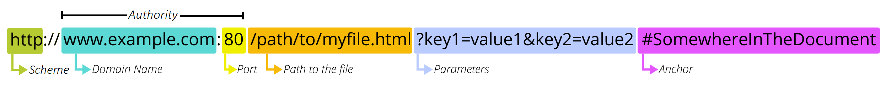

도메인과 URL을 쉽게 이해 하고 이를 활용하여 개인보안 능력 키우기
<!-- more -->

## 1️⃣ 작성 목적

URL을 학습하여 이해하고 이를 바탕으로 업무와 개인(회사)보안에 적용

## 2️⃣ URL의 구조

>[!tip]
>📌 Parameters와 Anchor, Port는 중요하지 않고, 나머지 항목의 역할만 확인 하시면 됩니다.

1. Scheme : URL의 프로토콜(규칙)을 정의합니다. 즉, 어떠한 규칙을 갖고 서버와 통신을 하게 되는지 알 수 있습니다. + 보안성(http**s**) 에 대한 확인도 가능 합니다. 
2. Domain Name : Main 도메인인지 Sub 도메인인지 확인 할 수 있으며, 사이트의 대략적인 카테고리를 알 수 있습니다. 
3. Port : 서버로 접속하는 길이라고 생각하면 쉽습니다. 일반 유저에게는 공개되지 않는 값으로 몰라도 됩니다. 
4. Path to the File : 파일(폴더)의 경로라고 이해 하시면 됩니다. 컴퓨터에 있는 폴더들도 이와 같은 구조를 갖고 있으며, 해당 Path를 통해 현재 페이지가 어떤 페이지인지 유추 할 수 있습니다. 

## 3️⃣ 도메인이란?

- 도메인은 인터넷에 연결된 컴퓨터의 IP 주소를 사람이 쉽게 기억하고 입력할 수 있도록 만든 인터넷 주소입니다.
- 숫자로 이루어진 IP 주소 대신, 도메인은 영문, 한글 등의 문자로 구성되어 있어 기억하기 쉽고 입력하기 편리합니다.
- 지도 좌표 : 집주소 = IP : 도메인

## 4️⃣ 도메인의 종류

>[!tip]
>📌 아래와 같이 도메인을 통하여, 사이트의 카테고리를 추측 할 수 있습니다. 
>**단, 도메인은 사이트 관리자가 자유롭게 만들 수 있기 때문에 100% 신뢰 할 수 없습니다.**

- **.com(상용) / .co(기업):** 비즈니스, 개인 및 모든 유형의 회사에 적합합니다. 가장 널리 사용되는 도메인 확장자이며 상업적 의도의 상징입니다.
- **.net(네트워크):** 온라인 네트워크를 구축하려는 모든 유형의 조직에 적합합니다. 이 도메인 확장자는 원래 네트워크 지향 웹사이트를 위해 의도되었지만 지금은 다양한 회사에서 사용됩니다.
- **.mil(군사):** 미국 군사기관에서만 사용합니다. 이 도메인 확장자는 공식 미국 군사용으로 제한되며 대중이 사용할 수 없습니다.
- **.gov / .go(정부):** 주로 정부 기관, 정부 관계자 및 웹사이트에 권장됩니다. 검증된 정부 기관에서만 사용할 수 있는 신뢰할 수 있는 도메인 확장자입니다.
- **.edu(교육):** 이 도메인 확장자는 공인된 교육 기관을 위한 것으로, 학교, 대학 및 교육 기관에 적합합니다.
- **.org / .or(조직):** 처음에는 비영리 조직을 위해 지정되었지만 지금은 비정부 조직과 커뮤니티 프로젝트를 포함한 다양한 그룹에서 널리 사용됩니다.

## 5️⃣ 서브도메인이란

[map.naver.com](https://map.naver.com/)는 네이버의 서브도메인입니다.

>[!tip]
>📌 즉, 서브도메인 이란, 도메인 앞에 . 을 붙혀 새로운 만든 도메인 입니다. 
>**중요한 점은, 서브도메인은 무조건 메인도메인을 소유한 사람만 만들 수 있습니다.**

예를 들어 [naver.bad.com](http://naver.daet.com) 이라는 도메인이 있다고 가정하겠습니다. 

위 도메인은 naver의 도메인 일까요?

정답은 **아닙니다.**

해당 도메인은 [bad.com](http://bad.com) 이라는 도메인 소유자가 만든 서브도메인 입니다. 

위와같은 방식은 스팸메일에서 많이 볼 수 있습니다. 해당 예시는 하기 6번에서 상세하게 다루겠습니다. 

## 6️⃣ URL을 업무, 개인보안에 활용하는 방법

1. 가짜도메인(서브도메인)으로 발송한 스팸메일 구분하기
    [apple@apple.iphone.com](mailto:apple@apple.iphone.com) 메일주소로 “[공식]아이폰 초특가 할인 행사” 라는 메일 왔다고 가정 하겠습니다. 

    - 이메일을 보내기 위해선 SMTP 서버를 세팅해야 하는데, 추가적인 개념이 필요하니 다음 기회에 설명 하겠습니다.
    - 간단하게, 이메일 주소의 @를 기준으로 앞은 사용자가 마음대로 조작 할 수 있으며, 뒤는 도메인을 소유 하고 있어야 세팅이 가능 합니다.

>[!tip]
>📌 즉, [apple@apple.iphone.com](mailto:apple@apple.iphone.com) 메일은 Apple에서 보낸 메일이 아닌 iphone.com 도메인을 소유한 사람이 보냈다는 말이 됩니다.

제가 최근에 회사메일로 받은 이메일 입니다. (하기 이미지)

- CJ대한통운에서 보낸 메일이지만 보낸사람 주소를 보면 **@autotronic.co.id** 인것을 볼 수 있습니다.
- 제가 [autotronic.co.id](http://autotronic.co.id/) 사이트로 접속 해보니, IoT 기기대여 업체라고 소개를 하고 있습니다.
- 예, 위장 사이트 입니다. 즉, 하기 메일은 전형적인 스팸 메일이며, 첨부파일을 다운로드하면 바이러스가 컴퓨터에 깔리게 됩니다.
     

- **위와같은 메일들은 절대 열어보면 안되며, 메일에 있는 이미지, 링크, 첨부파일을 클릭하면 바로 해킹이 됩니다. 주의 하세요!**

2. 도메인 종류로 사이트 빠르게 파악
    - 고등학교 과정에 있는 내용으로 간단하게 정리합니다.
    - [4️⃣ 도메인의 종류](#4️⃣-도메인의-종류) 부분을 참고 하셔서 내가 방문한 사이트의 카테고리를 파악 하고 구분 할 수 있습니다.
3. 서브도메인을 이용한 악성 사이트 판별하기
    - “청년도약계좌 조건 확인”으로 구글 검색을 하고 제일 상단에 있는 [ylaccount.kinf.or.kr](https://ylaccount.kinf.or.kr/main) 사이트에 접속 했다고 가정 하겠습니다.
    - 아무런 의심 없이 계좌 개설 조건을 확인 하기 위해 개인정보를 입력하면, **해커에게 개인정보를 제공**하게 됩니다.

>[!tip]
>📌 위와같은 도메인이 있을 경우 공신력을 파악하기 위해 메인도메인(kinf.or.kr)을 따로 검색 해 본 후 해당 사이트의 공신력을 검증 하는 것을 제안 드립니다.

## 결론

1. 웍스, 네이버, 구글에서 스팸으로 분류한 이메일은 이유없이 분류하지 않습니다. 이와같은 메일들은 절대 열어 보시면 안됩니다. 
2. URL(도메인)의 구조와 역할을 이정도만 이해하여도, 해커 머리위에 있을 수 있습니다. 메신저나 메일로 받은 링크, 첨부파일은 반드시 미리 점검해보는 습관이 필요합니다. 
3. QR코드도 URL과 같습니다. 길거리에 돌아다니는 QR코드를 찍는 것만으로 해커의 타겟이 될 수 있습니다. 
4. 도메인을 확인하면 사이트의 정보를 미리 파악 할 수 있고, 리서치가 많은 업무에 활용하면 큰 도움이 됩니다.