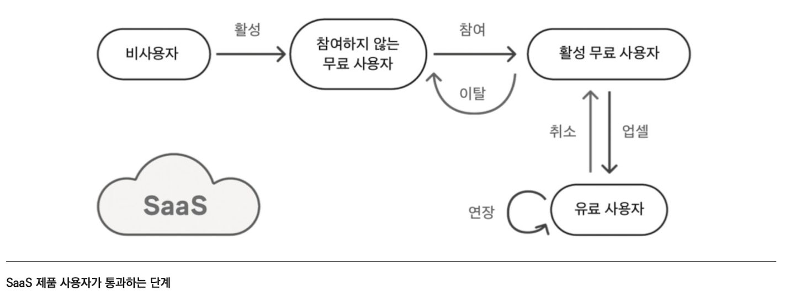

- 415 ~ 428p 23장 ToS 전까지

<!-- more -->

>[!tip]
>7가지 코드 - 닐 메타, 아디티야 아가쉐, 파스 디트로자 지음

# 제품에 필요한 지표는?

# 요약

- 선행 지표는 특정 지표를 넘었을때 그 가치가 달라지는 지점을 말한다. 그로스 PM은 회사에 도움이 되는 선행 지표를 찾는다. 이는 신규고객의 온보딩 경험을 설계하는 것에 강점이 있다.
- 우리 서비스에서 매출이 되는 활성 사용자의 지표는 단순 가입자 지표보다 중요하자. 즉 쓸모있는 지표와 없는 지표를 구분 할 수 있어야 한다.

---

- SaaS 모델의 장점은 구독모델이라는 안정적인 매출과 쉬운 업데이트이다. 
이와같은 제품의 지표 모델은 다음과 같다.
    - 싸스 지표 모델
        
        
        
    
    요기서 주요 지표는 무료 사용자에서 유료 사용자로 업그레이드하는 사용자의 비율이다. 
    
- 어플리케이션은 인앱 구매 또는 구독의 형태로 유료 업그레이드를 제공한다. 
넷플릭스 같은 구독 기반 프리미엄 제품의 매출 및 사용자 지표는 SaaS 제품의 지표와 유사하다. 인앱 구매 구조에서는 고래 현상이 많이 발생한다. 즉 고래가 많아 지는 것이 중요하다. 이는 게임에서 중요하며, ARPU가 중요하지만 ARPPU가 더더욱 중요하다.
- UGC(사용자 생성 콘텐츠) 제품은 SNS 유튜브와 같은 서비스며, 이들은 광고노출이 수익원이다. 따라서 중요한 지표는 사용자가 얼마나 오래, 자주 머무는지의 지표가 중요하다.

# 교훈 및 적용

- 제품별로 중요하게 보여지는 지표들에 대해 보았다. 역시 내 제품에 적용하자