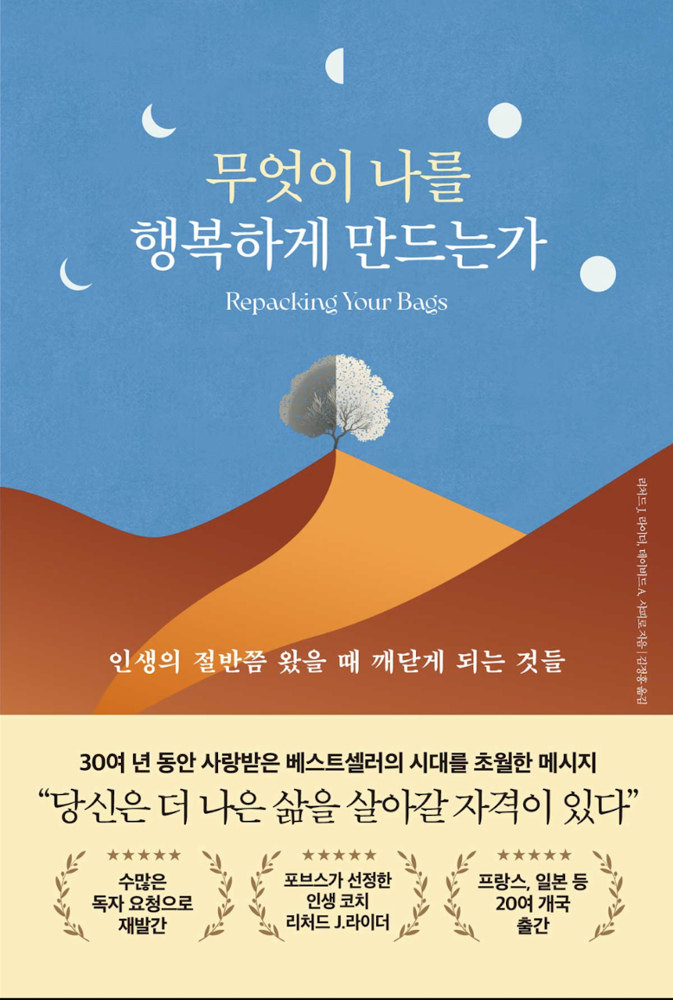

- 나의 인생의 가방에 무엇을 담아서 여행일 떠날 것인가! 

<!-- more -->

>[!important]
>무엇이 나를 행복하게 만드는가 - 리처드 라이더, 데이비드 샤피로 지음

## 인생은 가방에 필요한 물건을 넣고 떠나는 여행과 같다
이책에서 가장 많이 나오는 단어는 가방이다.
이생을 여행에 비유하며, 내가 인생에서 가장 가치하는 것들을 여행가방에 넣는 물건들에 비유하고있다. 
인생의 가방은 
- 서류가방(일을 위한 가방)
- 여행가방(사랑을 위한 가방)
- 가방트렁크(살 곳을 위한 가방)
이렇게 3개로 분리하고, 그 안에 들어가는 물건들을 자신의 가치관을 기준으로 담는다.
## 가방에 담아야 할 것이 무엇일까?(내기준)
가방은 한정된 크기를 갖고있다. 과연 나의 서류가방과 여행가방, 가방트렁크에 무엇을 담아야 할까?
1. 서류가방(일을 위한 가방)
	- [ ] 나의 재능이 무엇이고 지금 일에서 그 재능을 발휘 할 수 있나?
	- [ ] 세상에 도움을 줄 수 있는 나의 재능은 무엇일까?
	- [ ] 업무 환경은 좋은가?
	- [ ] 일에서 즐거움을 느끼는가?
2. 여행가방(사랑을 위한 가방)
	- [ ] 나와 가장 가까운 사람은 누구인가?
	- [ ] 내가 가장 사랑하는 사람은 누구인가?
	- [ ] 왜 사랑 하는가?
	- [ ] 사랑하는 사람과 무엇을 하고 싶은가?
3. 가방트렁크(살 곳을 위한 가방)
	- [ ] 나에게 집은 무엇인가?
	- [ ] 집에 불이나면 무엇을 가장 먼저 챙겨 나오겠는가?
	- [ ] 어디에 살고 싶은가?
## 길을 잃어야 새로운 길을 발견 할 수있다. 
앞에 내용들도 중요하지만 핵심은 이부분 이라고 생각한다. 
인생을 여행에 비유했으니 쉽게 이해 할 수 있다. 내가 길을 잃었다는 것은 새로운 길을 찾고 있다는 것이다. 하지만, 나도 그렇고 많은 사람들이 길을 잃는 것 자체를 두려워 하여서 아는 길로만 가려고 한다. 
두려워 하면 안된다. 
## 결론
내 가방에 넣어야 할 것이 무엇일지 생각해보면,
1. 사명
2. 가족
3. 일

이며, 이 안에서는 

1. 고아 및 홀부모 가정 사역
2. 청소년 사역
3. 가족과 친구
4. 사랑하는 사람들
5. PM 업무
6. TI 사업

정도로 정리 할 수 있을 것같다.
인생에 남길 책은 아니지만 가볍게 읽을만한 책인 것같다. 