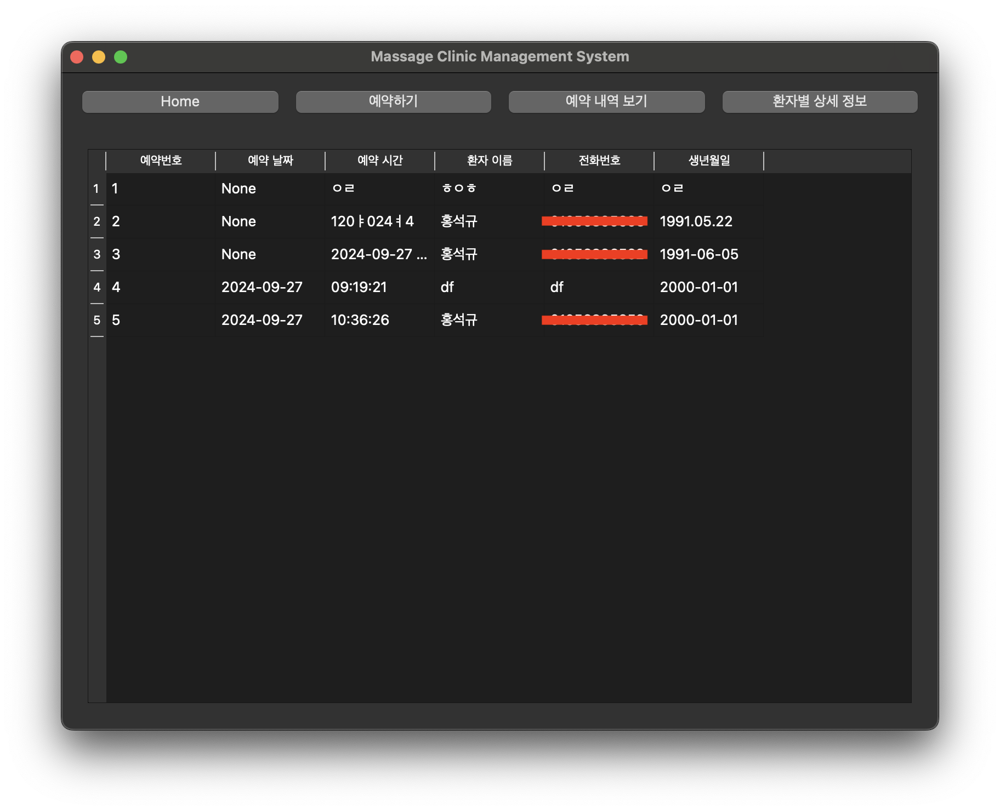
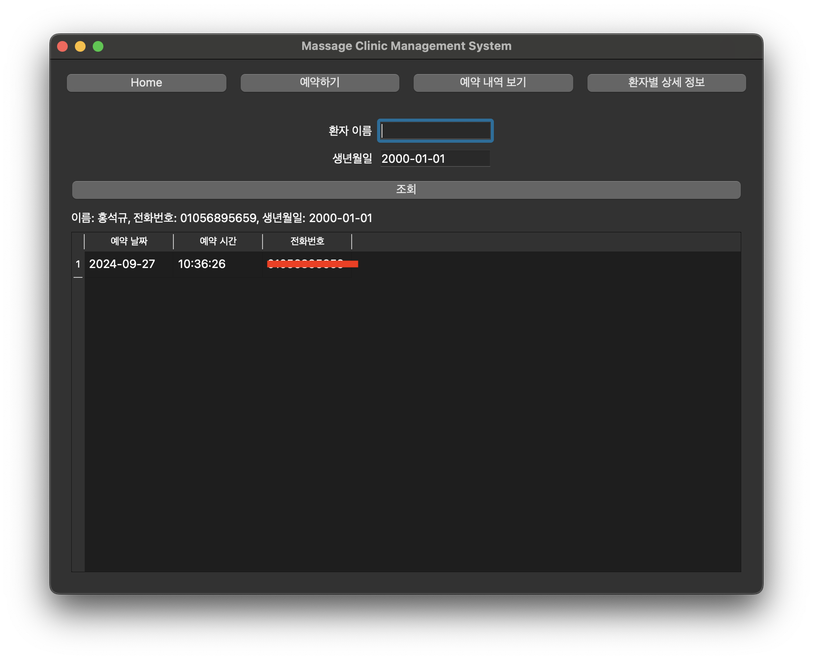

- 아버님 사무실에 놀러갔다가 명령 받은 고객관리 시스템 구축 과정을 정리한다.

<!-- more -->

## 왜 갑자기 Window App을 만드는가?
나의 아버지는 맹인 지압원을 운영 하시고,  
이를 위해 오시는 환자분들의 예약, 처치 내역, 치료 결제 내역, 환자 정보 등을 관리 하셔야 한다.  
연세가 벌써 60 중반대이시다 보니 이런 데이터들을 관리하는데 어려움이 있다고 하셨다.  
현재는 엑셀로 관리를 하고 있는데, 거의 5년 넘게 저장한 데이터들을 관리하다 보니 어려운 점이 한두개가 아니라고 하셨다.  
그래서 효자인 나는 이 문제를 해결해 보고자 하였다.  
[DDEVI로 어머니 회사 홈페이지 만들어 주기 글](https://www.levih.me/biz/saas/DDEVI%EB%A1%9C-%EC%96%B4%EB%A8%B8%EB%8B%88-%ED%9A%8C%EC%82%AC-%ED%99%88%ED%8E%98%EC%9D%B4%EC%A7%80-%EB%A7%8C%EB%93%A4%EC%96%B4-%EC%A3%BC%EA%B8%B0.html) 참고하기

## 데이터 관리 현황
- 달력 포맷으로 관리하는 엑셀 파일이 있고, 해당 파일에서 약 7년간의 예약 일정을 관리중
- 환자 데이터는 나이대(20~30대)별로 엑셀파일이 있고, 환자별로 시트가 있음
- 환자별 시트에는 환자 상세 데이터와 그 환자의 예약 내역, 결제 내역, 처치내역 등이 있음

## Pain Point 분석
1. 달력에 엑셀에 많은 데이터가 있다보니, 히스토리를 찾기 힘듬
2. 환자 데이터를 나이대 별로 관리를 하다보니, 시간이 지났을때 나이대에서 벗어나는 문제
3. 환자 데이터가 여러 파일로 나누어져 있다보니 환자 검색이 거의 불가능함
4. 환자별로의 예약/처치 내용이 따로 관리 되다 보니 예약 정보와 연동 되지 않음
5. 환자데이터의 명확한 데이터 필드가 정의되어 있지 않음

## 해결 방안 아이데이션
우선 환자 데이터에 대한 Low Data를 하나로 통합 하여 관리하고,   
해당 DB에서 원하는 데이터를 보여주는 뷰페이지가 필요하다고 판단했다.   
그리고 예약 등록을 시스템화 하고, 이름+생년월일을 키로 하여 Low Data를 추가/수정 할 수 있도록 해야 한다.

## MVP 설계
우선 주요 구조와 기능 구현의 MVP를 설계해보자   
1. MVP 아키텍쳐

2. MVP App Home 화면

3. MVP App 예약하기 화면

4. MVP App 예약 내역 보기 화면

5. MVP App 환자별 상세 정보

## 사용 언어 및 라이브러리
- Python
- PyQt5
- sqlite3   

다음 포스트에서부터 상세 기능들에 대한 구현을 시작 하자 
