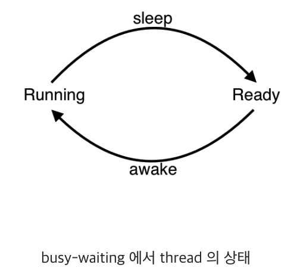
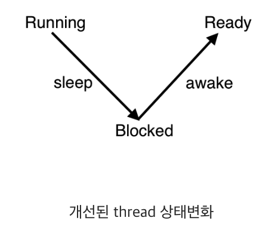
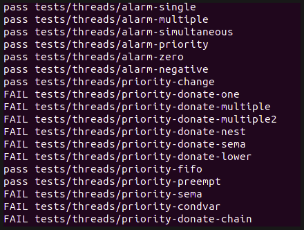
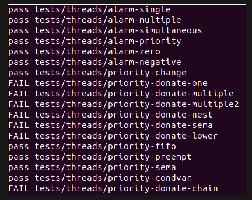
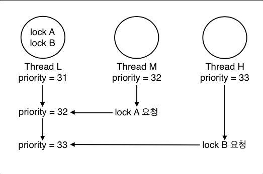
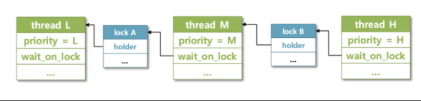
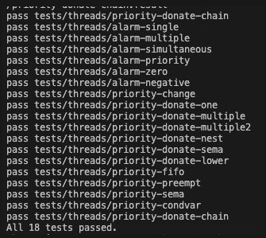

- SW사관학교 정글 5기 8주차 회고
<!-- more -->

## 1. PintOS 동기화에 관한 주요 용어 정리

### 1) 스레드(Thread)

- 프로세스 ‘내’에서 실행되는 흐름의 ‘단위’를 말한다.
- 멀티 스레드(multi_thread) : 프로세스 내에는 최소 한개 이상의 스레드가 실행 될 수 있다.
- 아주 큰 장점으로는 하나의 프로세스에서는 여러 스레드가 자원(메모리)를 공유하게 된다.

>[!info]
>멀티 프로세스와의 차이점으로는 각각의 프로세스는 자원을 공유할 수 없다.

### 2) 인터럽트의 비활성화(Disabling Interrupts)

- 커널의 스케쥴링 방식에 따라 CPU 사용을 선점 당할 수 있는지의 여부가 달라진다.
- PintOS는 커널 스레드가 언제든지 선점 당할 수 있는 Preempible kernel(선점형 커널)이다.
- interrupt를 비활성화 하는 것만으로도 Synchronization(동기화)가 가능
    - 스레드 선점은 timer interrupt에 의해 일어나기 때문에 interrupt 자체를 막는다.
- 이 방법은 외부 인터럽트 핸들러를 동기화 시키기 위해 주로 사용된다.
    - 외부 인터럽트는 프로그램 내부에서 발생하는 인터럽트와 다르게 외부에서 발생하는 인터럽트로 sleep이 불가 하다.
    - 따라서 다른 동기화 도구가 사용될 수 없고, 가장 우선적으로 처리되어야 하기 때문에, 외부 인터럽트가 실행 되는 동안은 다른 모든 인터럽트를 비활성화 한다.
- <thread/interrupt.h>에 interrupt 들은 활성/비활성 할 수 있는 Type, function들이 있다.

### 3) 세마포어(Semaphores)

- 멀티 스레드는 프로세스의 ‘공유자원’을 서로 공유하게 된다.
- 임계구역(Critical Section) : 각 스레드에서 이 공유자원을 억세스 하는 코드 구역

>[!info]
>이때 같은 공유데이터에 여러 스레드가 동시에 접근하면 시간차이로 인한 잘못된 결과로 이어지기 때문에, 하나의 스레드가 임계구역에 들어가 있다면 다른 스레드들은 인계구역에 접근하는 것을 ‘제한’ 해야 한다.

- 세마포(Semaphores) : 공유자원을 여러 스레드가 동시에 접근 하지 못하도록 하는 도구
    - Nonnegative integer와 두개의 Operators로 이루어짐
    - Nonnegative integer : 사용 가능한 공유자원의 개수
        - 만일 값이 2라면 2개의 스레드가 동시에 접근이 가능하고, 값이 0이면 사용가능한 공유자원이 없다는 것을 의미
    - Nonnegative integer 조작 방법
        - “Down”(or “P”)
            - 스레드 임계구역 입장 → 공유자원 사용 요청 → 사용가능한 공유자원 개수 1개 이상(양수) → 수를 1 감소 시킴 → 임계구역 실행(공유자원 사용)
            - 공유자원 개수 0 이하 → 양수가 될때 까지 임계구역을 실행하지 않고 기다림
        - “Up”(or “V”)
            - 스레드가 임계구역의 실행을 모두 마침 → 공유자원 반납 → 사용 가능한 공유자원의 개수를 1 늘림
- 0으로 초기화 되는 경우 : 스레드 A 가 우선 기다림 → 스레드 B의 작업이 끝나면 A가 실행
- 1로 초기화 되는 경우 : 스레드 A 가 우선 실행됨 → A의 작업이 끝나면 기다리던 B가 실행

### 4) Locks

- 세마포랑 마찬가지로 공유자원을 관리하는 동기화도구 중 하나다.
- “Up”대신 “release”, “Down” 대신 “acquire”라는 이름의 Operator로 동작

>[!info]
>Lock에는 세마포에는 없는 하나의 제약이 있다! 밑에 설명

- Acquire를 호출한 스레드만이 해당 Lock을 release 할 수 있다.

### 5) Monitors

- 공유자원, 모니터 락, 조건변수로 이루어 진다.
- 각각의 스레드들은 서로 Mutual Exclustion(상호배타)가 된다.
    - 즉, 공유자원을 하나의 스레드만 사용 할 수 있는 상태가 된다.
- 좀더 공부가 필요!

---

## 2. 알람시계 구현

### 1) 목표

- 현재는 timer_sleep()에서 매 틱마다 thread_yield ()로 깨워서 확인 하고 있다.

```c
void
timer_sleep (int64_t ticks) {
    int64_t start = timer_ticks (); //ticks값을 반환 함

    ASSERT (intr_get_level () == INTR_ON);
    while (timer_elapsed (start) < ticks)
         thread_yield ();

```

- CPU가 매우 비효율 적으로 일어날 시간을 확인 하고 있다.
- 이 방식을 busy waits 방식이라고 한다.



💡 따라서 우린 다른 방식으로 확인 비용을 줄여 일어나야 할 시간에 스레드를 깨우는 알람시계를 만들면 된다.

### 2) 방법

- block_list를 만들어 블록 상태인 스레드를 넣어 관리한다.
    - 현재는 모두 ready_list에 있다.
    - 어떻게 block_list에 넣는가?
- 블록하면서 어딘가에 넣을때 깨울 시간을 넣어서 저장해야 한다.
    - 깨울 시간은 어떻게 저장 하는가?
    - 깨울 시간은 어디서 체크하는가?
    - 잠든 스레드는 어디에 저장 하는가?
- 위와 같은 물음들을 하나씩 해결 해야 한다.



### 3) sleep_list를 만들어 잠자는 thread를 저장하자

- PintSO 자료는 list를 쉽게 만들고 관리할 수 있도록 코드가 제공된다.
- 우리는 sleep_list를 생성하여 잠들은 thread를 관리하겠다.

```c
//thread.c

void
thread_init (void) {
...
list_init (&sleep_list);  //sleep_list 생성
...
}

```

### 4) sleep_list에 넣기 전 thread 구조체에 일어날 시간을 기록

- thread구조체에 wakeup_time이라는 변수를 선언하여 준다.

```c
//thread.h

struct thread {
...
int64_t wakeup_time;                /*잠잔 노드가 일어날 시간*/
...
}

```

### 5) 일어날 시간은 어떻게, 어디서 넣어줄까?

- 일어날 시간은 ‘OS가 시작된 시간 + 잘시간’으로 저장 한다.
- timer_sleep함수에서 thread_sleep함수를 호출할때 일어날 시간을 계산하여 넘긴다.

```c
//timer.c

timer_sleep (int64_t ticks) {
    int64_t start = timer_ticks (); //OS가 시작된 시간으로부터의 ticks값을 반환 함

    ASSERT (intr_get_level () == INTR_ON);

    thread_sleep(start + ticks);
}

```

- 그리고 thread_sleep 함수에서 일어날 시간을 넣어 준다.
- interrupt로 원자성을 보장한다.
- 선언한 thread 구조체의 wakeup_time 값을 ticks 바꿔준다.
- list_push_back 를 사용하여 sleep_list에 삽입한다.
- 마지막으로 thread를 block하고 스케쥴링한다.

```c
//thread.c

void
thread_sleep(int64_t ticks){
    struct thread *cur = thread_current();     //현재 실행중인 스레드
    enum intr_level old_level;                //지금 인트러덥트

    old_level = intr_disable ();         //interrupt off

    cur -> - 선언한 thread 구조체의 wa;        //깨어나야 할 ticks 저장
    list_push_back (&sleep_list, &cur->elem);    //슬립 큐 삽입

    thread_block();                    //block하고
    intr_set_level (old_level);            //interrupt on
}

```

### 6) 깨울때는 어떻게 깨울까?

- 간단히는 sleep_list를 확인하여 현재 시간보다 작거나 같은 wakeup_time인 thread를 깨운다.
- list_begin 함수로 sleep_list의 시작 elem를 가져온다.
- 가져온 thread의 wakeup_time을 비교하여 깨워야하면 리스트에서 삭제 후 unblock 한다.

```c
//thread.c

void
thread_awake (int64_t ticks){        // 현재 시간
    /*sleep_list의 모든 entry순회*/
  struct list_elem *e = list_begin (&sleep_list);     //sleep_list의 시작 스레드 포인터를 리스트요소로 할당

  while (e != list_end (&sleep_list)){                //sleep_list의 시작과 끝이 같지 않다면 반복문 시작(같을때까지)
    struct thread *t = list_entry (e, struct thread, elem);     //e(sleep_list 시작)의 포인터를 thread t 구조체 포인터로 할당
    if (t->wakeup_time <= ticks){    // 스레드의 일어난 시간이 지금 시간보다 작거나 같으면
      e = list_remove (e);    // sleep list 에서 제거
      thread_unblock (t);    // 스레드 unblock
    }
    else
      e = list_next (e);
  }
}

```

- 지금까지 구현을 하면 좀더 효율적인 thread 깨우기 방법이 된다.
- 하지만 위 과정을 보면 한가지 걸리는 부분이 생길 것이다.
- 바로 ‘Running을 시키는 기준에 대해서’ 이다.
- 다음과정은 우선순위를 고려하여 Thread를 Running 방법에 대해 구현을 하겠다.

## 3. 우선순위 스케쥴링(Priority Scheduling)_1

### 1) 문제점

- 현재 문제점은 ready_list에 스레드를 넣는 과정에서 무조건 조건 없이 뒤에 넣고 있다.
- thread의 priority가 가장 빠른 것이 먼저 실행이 되어야 하기 때문에 우린 이 문제를 해결하여 한다.

### 2) 목표

- ready_list 의 thread를 우선 순위(priority)를 고려하여 running 하기

### 3) 방법

- 방법 1 : ready_list에서 pop을 할때 우선순위를 고려
- 방법 2: ready_list에 push를 할때 우선순위를 기준으로 정렬

💡 list.c에 list_insert_ordered() 함수를 사용하기 위해 방법 2번으로 구현을 하려 한다.

### 4) list_insert_ordered() 함수 뽀개기

- 받는 인자(총 4개의 인자를 받음)
    - list : 삽입 할 리스트 구조체
    - list_elem : 삽입 할 리스트 요소의 구조체
    - list_less_func
        - less 함수 구조체를 받아온다.
        - 이 함수는 다시 3개의 인자를 받는다.
            - 첫번째 list_elem(a)와 두번째 list_elem(b)를 비교하여 a가 작으면 true, b가 작으면 false를 반환한다.
            - 마지막 인자는 보조인자(aux) 이다.
    - aux : 보조 인자
- for문으로 리스트를 순회 하며 less 함수를 실행 한다.
    - 이때 less함수는 삽입할 elem가 뒤(e)보다 작으면 true(elem < e)를 리턴 한다.
    - `for (e = list_begin (list); e != list_end (list); e = list_next (e)) if (less (elem, e, aux))//less 함수 : e를 하나씩 옮겨 가면서 elem과 계속 비교하며 반복, break; //삽입할 elem가 뒤(e)보다 작으면 true(elem < e)`
- 그리고 리턴으로 list_insert()를 실행 하여 리턴 하는데, list_insert 함수는 첫번째 인자 요소 앞에 두번째 인자를 넣는다.

💡 따라서 list_insert_ordered함수를 push대신 그대로 사용하면 오름차순이 되기 때문에 내림차순으로 정렬되면서 list에 넣도록 해야 한다.

### 5) less 대신 사용하는 more함수 구현

- 위에 말한 것 처럼 우린 less 함수의 반대로 true/false를 반환하는 함수를 만들면 된다.
- 해당 함수는 나중에 계속해서 사용하고 sort를 할때도 사용하니 주의깊게 봐야 한다.

```c
//thread.c
/*앞에가 크면 true!*/
bool
more(const struct list_elem *a, const struct list_elem *b, void *aux){
    return list_entry (a, struct thread, elem) -> priority
            > list_entry (b, struct thread, elem) -> priority;
}

```

### 6) list_push_back()를 list_insert_ordered() 로 수정 하기

- 우리가 바꾸어야 할 함수는 총 3개이다.
    - thread_sleep()
    - thread_unblock()
    - thread_yield()

### 7) 실행 중인 thread의 우선순위가 바뀌는 케이스

- 실행중인 thread의 우선순위가 바뀌는 케이스는 두가지 이다.
    - thread_create()
    - thread_set_priority()
- 따라서 위 경우 진행중인 스레드의 우선순위를 현재 ready_list에서 가장 큰(맨앞) thread와 비교하여 thread_yield()해주면 된다.
- 이 케이스는 앞으로 더 있을 것 같으니 함수로 만들자
- 한가지 추가 조건으로는 ‘현재 실행중인 스레드가 idle_thread가 아닐 조건도 추가 하였다.

```c
//thread.c
/*지금 실행중인 스레드의 우선순위와 ready_list 맨 앞에 스레드우선순위를 비교하여 y*/
void
thread_comp_ready() {
    struct thread *curr = thread_current();
    int e = (list_entry(list_begin (&ready_list), struct thread , elem) -> priority);

    if (curr -> priority < e && thread_current() != idle_thread){
        thread_yield();
    }

}

```

- 위와같이 만든 함수를 각각 넣어주면 된다.

```c
//thread.c
void
thread_set_priority (int new_priority) {
    struct thread *curr = thread_current();
    curr->priority = new_priority;

    thread_comp_ready();

}

```

```c
//thread.c
tid_t
thread_create (const char *name, int priority,
        thread_func *function, void *aux) {

     ...

    /* Add to run queue. */
    thread_unblock (t);

    thread_comp_ready();

    return tid;
}

```

- 결과



## 4. 우선순위 스케쥴링(Priority Scheduling)_2

### 1) 목표

- 주어진 동기화 도구를 활용하여 스레드를 스케쥴링하자

### 2) 도구

- Semaphore
    - value : 공유자원의 개수를 나타낸다.
    - list waiters : 공유자원을 사용하기 위해 대기하는 스레드 리스트
    - `struct semaphore { unsigned value; /* Current value. */ struct list waiters; /* 대기 중인 스레드 목록. */ };`
- Lock
    - thread holder : 현재 해당 lock을 갖고 있는 스레드
    - semaphore
    - `struct lock { struct thread *holder; struct semaphore semaphore; /* 접근을 제어하는 바이너리 세마포어. */ };`
- Condition variable
    - list waiters : Condition variable가 만족하기를 기다리는 waiters 리스트
    - `struct condition { struct list waiters; /* List of waiting threads. */ };`

### 3) 문제 해결 방법_01_Semaphore

- 공유자원 하나를 사용하기 위해 여러 스레드가 sema down되어 waiters 리스트에 있다고 가정하자
- 공유자원을 사용하던 스레드가 사용을 마치고 sema up을 할때 어떤 스레드를 먼저 사용할지 고민 해야 한다.
- 하지만 우린 위 문제를 이미 고려를 했던 적이 있다. (잠자는 스레드를 깨울때)
- 동일하게 waiters 리스트에 넣을때 정렬해서 넣고, Pop할때는 맨 앞에 elem을 pop하면 된다.
    - 주목할 점은 list_insert_ordered()사용 시 more 함수로 인자를 ‘동일하게’사용한 점이다.

```c
//synch.c
/*리스트에 넣을때 정령되게 넣는다.*/
void
sema_down (struct semaphore *sema) {
    enum intr_level old_level;

    ASSERT (sema != NULL);
    ASSERT (!intr_context ());

    old_level = intr_disable ();
    while (sema->value == 0) {
        // list_push_back (&sema->waiters, &thread_current ()->elem);
        list_insert_ordered (&sema->waiters, &thread_current ()->elem, more, 0);
        thread_block ();
    }
    sema->value--;
    intr_set_level (old_level);
}

```

- 추가로 pop할때(sema_up)는 그냥 빼면 되지만 빼기 전 리스트에 있던 상태에서 우선순위 값이 바뀌는 케이스가 있기 때문에 sort를 한번 해준다.
    - 동일하게 more 함수를 사용한 점을 주목
    - unblock() 이후 unblock된 스레드가 running 스레드보다 우선순위가 높을 수 있어 thread_comp_ready() 실행 → CPU선점

```c
void
sema_up (struct semaphore *sema) {
    enum intr_level old_level;

    ASSERT (sema != NULL);

    old_level = intr_disable ();

    if (!list_empty (&sema->waiters))
    {
        list_sort (&sema->waiters, more, 0); // 솔트 추가한거

        thread_unblock (list_entry (list_pop_front (&sema->waiters),
                    struct thread, elem));
    }
    sema->value++;
    thread_comp_ready();              //실행 되기전 스캐쥴링을 위해

    intr_set_level (old_level);
}

```

### 4) 문제 해결 방법_02_Lock

- lock_acquire 함수와 lock_release 함수는 sema_up/down으로 끝난다.
- lock은 semaphore와 동일하게 동작 하므로 별도 처리는 우선 필요 없다.

### 5) 문제 해결 방법_03_Condition variables

- semaphore와 방식은 동일하나 차이점이 하나 있다.
- condition variables의 waiters는 세마포어들의 리스트 이다.
    - 아래 는 cond_wait()에 있는 list_push_back()이다.

```c
list_push_back (&cond->waiters, &waiter.elem);

```

- 기존에 사용하던 함수이지만 elem를 넣는 인자를 주목해서 봐야 한다.
    - 위에 말한 것 처럼 요기서의 waiter는 세마포어의 element이다.
    - 이번에는 입력받는 파라미터가 스레드가 아니라 semaphore_elem.elem로 들어오기에 list_insert_ordered() 함수에 들어갈 more 함수를 새롭게 만들어야 한다.

```c
//synch.c
bool
sema_more(const struct list_elem *a, const struct list_elem *b, void *aux){
    struct semaphore_elem *sa = list_entry (a, struct semaphore_elem, elem);
    struct semaphore_elem *sb = list_entry (b, struct semaphore_elem, elem);

    struct list *waiter_sa = &(sa->semaphore.waiters);
    struct list *waiter_sb = &(sb->semaphore.waiters);

    return more(list_begin(waiter_sa), list_begin(waiter_sb), 0);
}

```

- 이제 semaphore 함수들과 같이 cond함수들도 수정하면 된다.

```c
//synch.c
void
cond_wait (struct condition *cond, struct lock *lock) {
    struct semaphore_elem waiter;

    ASSERT (cond != NULL);
    ASSERT (lock != NULL);
    ASSERT (!intr_context ());
    ASSERT (lock_held_by_current_thread (lock));

    sema_init (&waiter.semaphore, 0);
    // list_push_back (&cond->waiters, &waiter.elem);
    list_insert_ordered (&cond->waiters, &waiter.elem , sema_more, 0);
    lock_release (lock);
    sema_down (&waiter.semaphore);
    lock_acquire (lock);
}

```

- signal 함수에서 sema_up 전 우선순위가 바뀌는 테스트 케이스가 있어 sort를 한번 해준다.

```c
//synch.c
void
cond_signal (struct condition *cond, struct lock *lock UNUSED) {
    struct semaphore *sema;
    ASSERT (cond != NULL);
    ASSERT (lock != NULL);
    ASSERT (!intr_context ());
    ASSERT (lock_held_by_current_thread (lock));

    if (!list_empty (&cond->waiters))
    {
        list_sort (&cond -> waiters, sema_more, 0); //추가한거

        sema_up (&list_entry (list_pop_front (&cond->waiters),
                    struct semaphore_elem, elem)->semaphore);
    }
}

```

- 결과



## 5. 우선순위 스케쥴링(Priority Inversion)_donation

### 1) 문제 및 목표

- 여러스레드가 lock을 요청하고 점유하는 과정에서 Poriority inversion이 발생
- 이 Poriority inversion 발생을 막기 위해 Priority donation이라는 개념을 도입하여 스레드들이 우선순위대로 실행 되도록 한다.

### 2) Poriority inversion 대응을 위한 두가지 케이스

- Multiple donation
- Nested donation

### 3) Multiple donation

- 하나의 스레드가 갖고 있는 lock에 대해서 여러 스레드가 요청하여 Multiple donation이 일어난 상황이다.



### 4) Nested donation

- H스레드가 a락을 얻으려고 하지만 a락은 M스레드가 갖고 있고, 이 M스레드는 b락을 얻으려고 한다.
- 이와같은 과정이 단계적으로 일어날때의 문제 점이다.



자, 두 경우를 모두 해결해 보자

### 5) Thread 구조체 수정

- init_priority : 고유의 priority 값을 저장해 둔다.
- lock wait_lock : 내가 원해서 기다리고 있는 lock(이 lock이 release 되기를 기다린다.)
- list donations : 나에게 priority를 donation 해준 스레드의 리스트
- list_elem donations_elem : 이 리스트를 관리 하기 위한 element

```c
//thread.h
struct thread {

    ...

    /*donation 관련*/
    int init_priority;
    struct lock *wait_lock;
    struct list dona;
    struct list_elem dona_elem;

```

### 6) init_thread 함수 수정

- 자료구조 초기화

```c
//thread.c
static void
init_thread (struct thread *t, const char *name, int priority) {
    ...
    /*priority donation 관련 자료구조 초기화*/
    t->init_priority = priority;
    t->wait_lock = NULL;
    list_init(&t->dona);

}

```

### 7) lock_acquire 함수 수정

- 큰그림을 먼저 설명 후 코드를 수정 하겠다.
    - 스레드가 lock이 필요하면 해당 lock으로 요청을 한다. 이때 실행되는 함수이며, 누군가 선점하고 있는 경우와 아닌 경우를 나눌 수 있겠다.
    - 도네이션은 lock을 점유하고 있을때만 필요하기 때문이다.

```c
//synch.c
void
lock_acquire (struct lock *lock) {
    ASSERT (lock != NULL);
    ASSERT (!intr_context ());
    ASSERT (!lock_held_by_current_thread (lock));

    struct thread *t = thread_current();

    /*done 시작*/
    if (lock -> holder){                //lock의 holder가 있는 경우
        t -> wait_lock = lock;            //해당 lock을 스레드의 wait_lock으로 저장

        //해당 lock을 갖고 있던 스래드의 도네이션 리스트에 t스레드를 넣는다.
        list_insert_ordered (&lock->holder->dona, &t->dona_elem, more, 0);
        dona_priority();                //도네이션 시작!
    }

    sema_down (&lock->semaphore);
    t -> wait_lock = NULL;
    lock->holder = t;
}

```

### 8) dona_priority 함수 구현

- 실질적으로 내가 가지려고 하는 Lock을 갖고 있는 스레드에게 도네이션을 한다.
- 최대 깊이는 8개로 제한하여 주었다.

```c
//thread.c
void
dona_priority(void){
    struct thread *cur_t = thread_current();

    for (int depth = 0; depth < 8; depth++){
        if (!cur_t -> wait_lock){
            break;
        }
        struct thread *t = cur_t -> wait_lock->holder;
        t -> priority = cur_t -> priority;
        cur_t = t;
    }
}

```

- 요기까지가 priority donation이 완료 된다.

### 9) lock_release 함수 수정

- 스레드가 priority를 양도맏고 critical section을 끝내면 lock을 반환 하게 된다.
- 이때 과정을 함수로 정리한다.
- sema_up을 하여 lock의 점유를 반환 하기 전에 현재 나의 lock을 원하는 스레드들이 나에게 priority를 도네이션 해줬을 것이다.
- 이 스레드들이 dona_list에 있을 것이고 이것들을 삭제 해야 한다.

```c
//synch.c
void
lock_release (struct lock *lock) {
    ASSERT (lock != NULL);
    ASSERT (lock_held_by_current_thread (lock));

    lock->holder = NULL;

    remove_with_lock(lock);       //donaion 리스트에서 내 락을 원하는 스레드 삭제
    refresh_priority();           //priority 되돌리기

    sema_up (&lock->semaphore);
}

```

- lock_release 함수 수정
    - 해당 리스트를 돌면서 내 lock과 리스트에 내 lock을 원하는 스레드들을 모두 삭제 한다.

```c
//thread.c
void
remove_with_lock(struct lock *lock){
    struct thread *t = thread_current();
    struct list_elem *temp;
    for (temp =list_begin (&t->dona); list_end (&t->dona) != temp; temp = list_next (temp)){
        struct thread *t_t = list_entry(temp, struct thread, dona_elem);
        if (t_t->wait_lock == lock){
            list_remove (&t_t->dona_elem);
        }
    }
}

```

### 10) Refresh_priority 함수 수정

- 중요 포인트는 다음과 같다.
    - lock이 release된 스레드는 원래 priority를 다시 저장 한다.
    - 만약 dona 리스트가 비어있지 않다면, 우선 해당 리스트를 sort 해준다.
        - 리스트에 있으면서 priority가 변경된 케이스가 있기 때문이다.
    - remove 되지 않은 남은 스레드에서 priority가 가장 큰 (맨 앞에 리스트) 스레드와 현재 스레드의 priority를 비교하여 큰것을 현재 스레드에 할당한다.

```c
//thread.c
void
refresh_priority(void){
    struct thread *t = thread_current();

    //현재 스레드의 우선순위를 기부받기 전의 우선순위로 변경
    t -> priority = t -> init_priority;

    if (!list_empty(&t->dona)){

        list_sort(&t->dona, more, 0);

        struct thread *temp = list_entry (list_front (&t->dona), struct thread, dona_elem);

        if (temp ->priority > t->priority){
            t->priority = temp ->priority;
        }
    }
}

```

### 11) thread_set_priority 함수 수정

- 한 가지 추가로 고려해야 할점이 있다.
- thread_set_priority함수에서는 현재 스레드의 priority값을 값자기 변경 할 경우가 있다.
    - 이때 priority는 init_pritority를 말한다.
- 이때에는 yield 전에 refresh_priority 를 한번 해줘야 한다.

```c
//thread.c
void
thread_set_priority (int new_priority) {
    struct thread *curr = thread_current();
    curr->init_priority = new_priority;

    refresh_priority();

    thread_comp_ready();

}

```

- 결과



## 배운점, 회고

- 매우 힘들었다. 그래도 많이 따라갔다. 더 열심히 해야 한다.

- 영어가 많이 문제이다. 단어 공부 꾸준히 하자.

- 사고가 느리면 시간을 더 들여서 보자.