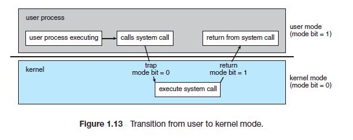
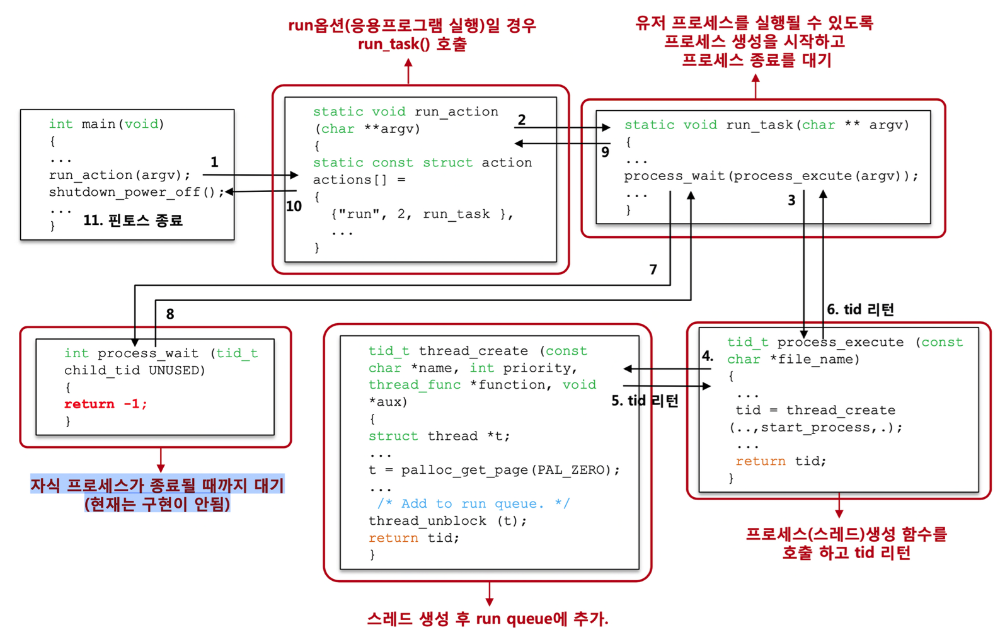

- SW사관학교 정글 5기 9주차 회고
<!-- more -->

## 1. User Program 관련 주요 용어 정리

>[!info]
>용어 정리
    
1) 인터럽트

    - 사전적 정의 : 끼어들다, 중단시키다.
    - 상세 설명 : [인터럽트(Interrupt)의 개념과 종류](https://raisonde.tistory.com/entry/%EC%9D%B8%ED%84%B0%EB%9F%BD%ED%8A%B8Interrupt%EC%9D%98-%EA%B0%9C%EB%85%90%EA%B3%BC-%EC%A2%85%EB%A5%98)

2) 시스템 콜

    - 커널영력의 기능을 사용자 모드가 사용 가능하게 하는 것
    - 즉 프로세스에서 하드웨어를 제어할 수 있게 해주는 것
    - 콜을 부르면 커널 내 정의된 스택에 접근 →인스트럭션 발생!

3) 사용자 및 커널 모드



4) 프로세스

    - 실행중에 있는 프로그램
    - 최소 하나의 스레드를 같고 있다. (pintos 에서는 하나의 프로세스는 하나의 스레드만 갖는다.)
    - 하드에 있는 프로그램을 실행 하고 실행을 위해 메모리 할당이 이루어 진다.
        - 이때 할당된 메모리 공간으로 바이너리 코드가 올라오면 이순간부터 ‘프로세스’라 한다.
    - [[운영체제] 프로세스란? (스케줄링, 메모리구조, 상태변화)](https://blockdmask.tistory.com/22)


## 2. PintOS 흐름도(Process의 생성과 종료)

### 흐름도 그림

- kaist-pintos와는 조금 차이가 있다. 아래 코드로 다시 정리
    

    
### 흐름 코드 정리
    
1) threads/init.c → main()
    
    - 핀토스의 메인 함수이다.
    - read_command_line()에서 명령줄을 읽어온다.
    - run_actions() 에서 커널 명령줄에 지정된 작업을 실행한다. (argv는 명령어 전체를 의미)
    
    ```c
    int
    main (void) {
    
    	...
    
    	argv = read_command_line (); //kernel command line을 읽어와서 arguments로 나눈다.
    	argv = parse_options (argv); //command line에서 options을 읽어 온다.
    	
    	...
    
    	/* 커널 명령줄에 지정된 작업을 실행합니다. */
    	run_actions (argv);
    
    	/* Finish up. */
    	if (power_off_when_done)
    		power_off ();
    	thread_exit ();
    }
    ```
    
2) threads/init.c → run_actions()
    
    - “run”일 경우 run_task를 실행
    
    ```c
    static void
    run_actions (char **argv) {
    	/* An action. */
    	struct action {
    		char *name;                       /* Action name. */
    		int argc;                         /* # of args, including action name. */
    		void (*function) (char **argv);   /* Function to execute action. */
    	};
    
    	/* Table of supported actions. */
    	static const struct action actions[] = {
    		{"run", 2, run_task},
    
    	...
    
    }
    ```
    
3) threads/init.c → run_task()
    
    - process_create_initd() 에서 프로세스 생성을 시작
    - process_wait() 는 해당 프로세스가 종료될 때 까지 기다린다.
    
    ```c
    static void
    run_task (char **argv) {
    	const char *task = argv[1];
    
    	printf ("Executing '%s':\n", task);
    #ifdef USERPROG
    	if (thread_tests){
    		run_test (task);
    	} else {
    		process_wait (process_create_initd (task));
    	}
    
    	...
    
    }
    ```
    
4) userprog/prosess.c → process_create_initd()
    
    - process를 생성하면서 thread를 만들어 준다
    - thread는 해당 파일 이름으로 생성
    - 생성된 Thread는 스캐쥴링 되어 run 또는 wait.
    - 이곳에서 페이지까지 할당 받는다.
    
    ```c
    tid_t
    process_create_initd (const char *file_name) { 
    	char *fn_copy;
    	tid_t tid;
    
    	/* Make a copy of FILE_NAME.
    	 * Otherwise there's a race between the caller and load(). */
    	/* FILE_NAME의 복사본을 만듭니다.
    	 그렇지 않으면 호출자와 load() 사이에 경쟁이 있습니다. */
    	fn_copy = palloc_get_page (0); // 커널 가상 주소 반환
    	if (fn_copy == NULL)
    		return TID_ERROR;
    	strlcpy (fn_copy, file_name, PGSIZE);
    
    	/*명령어 전체 중 file_name부분만 잘라서 넣어준다.*/
    	char *save_ptr;  
    	strtok_r (file_name, " ", &save_ptr);
    
    	/* Create a new thread to execute FILE_NAME. */
    	/* FILE_NAME을 실행할 새 스레드를 만듭니다. */
    	tid = thread_create (file_name, PRI_DEFAULT, initd, fn_copy);
    	if (tid == TID_ERROR)
    		palloc_free_page (fn_copy);
    
    	
    
    	return tid;
    }
    ```
    
5) 생성된 tid 값을 return 하여 process_wait()함수로 보낸다.
    
    - process_wait()에선 main thread는 모든 자식 스레드가 종료될때 까지 기다리는 상황이 된다.
    
    ```c
    int
    process_wait (tid_t child_tid UNUSED) {
    	struct thread *child = get_child(child_tid);	//넘어온 tid 값과 같은 자식 리스트의 스레드를 가져온다.
    
    	if (child == NULL){							//없다면 리턴 -1
    		return -1;
    	}
    	if (child->is_waited){						//아직 기다리라고 한 자식이면 리턴 -1
    		return -1;
    	}
    	else {										//자식이 있고 기다리라고 했던 적이 없다면 
    		child -> is_waited = true;				//자식을 기다리라고 한다. 
    	}	
    	sema_down(&child -> sema_wait);				//자식이 wait 상태인동안 인터럽트 활성화
    	int exit_status = child -> exit_status;
    	list_remove(&child->child_list_elem);		//자식 제거
    	sema_up(&child -> sema_free);				//free할 수 있도록 인터럽트 해제
    
    	return exit_status;			// 종료 상태를 리턴
    }
    ```
    
    - 모든 과정이 끝나면 1)번으로 돌아가 power_off () 하게 된다.

## 3. Process의 생성을 위한 Argument Passing → 인자 전달

- Argument Passing 이유와 목적
    
    1) Argument Passing 이유
    
        - 예를 들어 `/bin/ls -l foo bar` 와 같은 명령어가 주어 졌을때 단어를 띄어쓰기별로 쪼개어 스택에 넣어야 한다.
            - 그래야 각각의 명령어를 커널에 전달 할 수 있기 때문이다.
    
    2) Argument Passing 목적
    
        - Passing 한 텍스트들은 각각의 스텍의 포인터로 argv의 원소에 저장 하여 전달 해야 한다.
- 스택 저장 방법
    - 최종적으로는  `%rdi`, `%rsi`, `%rdx`, `%rcx`, `%r8`, `%r9` 시퀀스들을 전달 하기 위해 정수 레지스터를 사용한다.
    
    >[!info]
    >아래의 표는 스택과 관련 레지스터들이 유저 프로그램이 시작되기 직전에 어떤 상태인지를 보여줍니다.
    
    스택은 아래 방향으로 커진다는 사실을 알아두세요.
    
    | Address | Name | Data | Type |
    | --- | --- | --- | --- |
    | 0x4747fffc | argv[3][...] | 'bar\0' | char[4] |
    | 0x4747fff8 | argv[2][...] | 'foo\0' | char[4] |
    | 0x4747fff5 | argv[1][...] | '-l\0' | char[3] |
    | 0x4747ffed | argv[0][...] | '/bin/ls\0' | char[8] |
    | 0x4747ffe8 | word-align | 0 | uint8_t[] |
    | 0x4747ffe0 | argv[4] | 0 | char * |
    | 0x4747ffd8 | argv[3] | 0x4747fffc | char * |
    | 0x4747ffd0 | argv[2] | 0x4747fff8 | char * |
    | 0x4747ffc8 | argv[1] | 0x4747fff5 | char * |
    | 0x4747ffc0 | argv[0] | 0x4747ffed | char * |
    | 0x4747ffb8 | return address | 0 | void (*) () |
    
    > RDI: 4 | RSI: 0x4747ffc0

- Passing 코드
    - `process.c` →`load()`서 별도의 추가 함수 없이 Passing하였다.
    
    1) 1차 Passing
    
        - filesys_open() 전에 file_name만을 전달 하여야 하기에 1차 passing을 진행 한다.
        
    ```c
    static bool
    load (const char *file_name, struct intr_frame *if_) {
        
        ...
    
        /*---------------P2-----------------*/
    
        char *token, *argv[64], *save_ptr;  
        int argc = 0;
    
        token = strtok_r (file_name, " ", &save_ptr);
        while (token)
        {
            argv[argc] = token;
            token = strtok_r ('\0', " ", &save_ptr);
            
            // printf("잘 들어갔니?: %s ----- %p\n", argv[argc], &argv[argc]);
            argc ++;
        }
    
        /* Open executable file. */
        file = filesys_open (file_name);
    
        ...
    
    }
    ```
    
    2) 2차 Passing
    
        - 남은 뒷부분을 잘라 스택에 넣어주고 주소를 저장 하면 된다.
        - 몇가지 중요한 점이 있다.
            1. 값(argv[i])을 넣을때 마지막은 항상 ‘\0’(공백)을 넣는다.
            2. 값을 저장한 주소를 미리 저장해 둔다.
            3. 값을 저장 후 8바이트로 맞추기 위해 반드시 패딩을 넣는다. 
            4. 스택은 아래로 증가한다. 
    
    ```c
    static bool
    load (const char *file_name, struct intr_frame *if_) {
    
    	...
    
    	/* Start address. */
    	if_->rip = ehdr.e_entry;
    
    	/* TODO: Your code goes here.
    	 * TODO: Implement argument passing (see project2/argument_passing.html). */
    
    	//1. 첫 주소 부터 글자의 길이(끝에 \0포함) 만큼 넣어준다
    	//	글자 길이 만큼 저장 위치가 감소 해야 한다. (거꾸로)
    	//	argv[0]까지 = RDI: 4
    	uintptr_t start_p = (if_ -> rsp);	//초기 시작 포인터 저장
    	uintptr_t curr = 0;	//계속 갱신 되는 임시 포인터 
    	char *address[64];	//argv의 주소값을 저장할 배열
    
    	/*argc 자른 마디의 개수만큼 for문 돌린다.*/
    	for (int i = argc - 1; i != -1; i--)
    	{
    		size_t argv_size = (strlen(argv[i]) + 1);	//memcpy를 위한 사이즈(뒤에 '/0'을 하나씩 넣기위한 +1)
    		curr += argv_size;	//임시 포인터 갱신
    		address[i] = (start_p - curr);	//나중에 주소를 저장해야 하기에 지금 주소를 저장해둠
    		
    		memcpy ((start_p-curr), argv[i], argv_size);	//argv[i]의 데이터를 start 포인터에 저장 
    	}
    
    	//2. 마지막에 word-align = 0 으로 채운다 (8의 배수로 체운다)
    	size_t word_align_size = (start_p-curr) % 8;	//8의 배수로 채워야 하므로 나머지 만큼만 공백으로 채움
    	curr += word_align_size;
    	memset(start_p - curr, '\0', word_align_size);
    
    	//3. argv 배열의 마지막은 0으로 채운다. 
    	curr += 8;
    	memset(start_p - curr, 0, 8);
    
    	//3-1. argv의 주소값을 뒤에서부터 하나씩 넣는다
    	//	주소는 8바이트씩 넣는다. 
    	for (int j = argc-1; j != -1; j--)
    	{
    		size_t argv_size = 8;
    		curr += argv_size;
    		
    		memcpy ((start_p-curr), &address[j], argv_size);
    	}
    
    	//4. 마지막에 Return address 를 0으로 넣는다. 
    	curr += 8;
    	memset(start_p-curr, 0, 8);
    
    	//5. 저장했던 임시 포인터를 실제 rsp에 적용하고 나머지 포인터들도 세팅 한다. 
    	if_->rsp -= curr;
    	if_->R.rdi = argc;
    	if_->R.rsi = (if_->rsp)+8;
    
    	...
    
    }
    ```
    

## 4. System Calls

- 시스템콜 전체 흐름 코드
    - 예시는 open-normal 케이스로 정리
    
1. 테스트 케이스에서 어떤 테스트 케이스(open-normal)인지 main()으로 보냄
    
    - 해당 메인함수 위치 : `tests/main.c`
    - 그리고 각각의 `test_main()`으로 이동하여 시스템콜을 수행
    
    ```c
    int
    main (int argc UNUSED, char *argv[]) 
    {
      test_name = argv[0];
      msg ("begin");
      random_init (0);
      test_main ();
      msg ("end");
      return 0;
    }
    ```
    
2. tests/userprog/open-normal.c
    
    - `open()` 에 인자를 담아 시스템 콜을 요청
    - 해당 요청은 `lib/user/syscall.c` 로 이동
    
    ```c
    void
    test_main (void) 
    {
      int handle = open ("sample.txt");
      if (handle < 2)
        fail ("open() returned %d", handle);
    }
    ```
    
3. lib/user/syscall.c
    
    - 해당 인자들을 인터럽트 프레임으로 담아 `userprog/syscall.c` 로 전달 된다.
    
    ```c
    int
    open (const char *file) {
    	return syscall1 (SYS_OPEN, file);
    }
    ```
    
4. userprog/syscall.c
    
    - 인터럽트 프레임(`struct intr_frame *f`)으로 넘어온 사항은 다음과 같이 분리 할 수 있다.
        - rax : 시스템 콜 넘버, 최종 값을 리턴받는 주소이다.
        - rdi : file name 이 들어있고 첫번째 인자이다.
        - rsi : 값이 저장되어있는 주소가 시작되는 주소를 갖고 있고 두번째 인자이다.
        - rdx : 명령어 사이즈, 세번째 인자인다.
    
    ```c
    void
    syscall_handler (struct intr_frame *f UNUSED) {
    	// TODO: Your implementation goes here.
    	uint64_t syscall_no = f->R.rax;  // 콜 넘버
    
    	// uint64_t a1 = f->R.rdi;		// 파일 네임
    	// uint64_t a2 = f->R.rsi;		// v(데이터)
    	// uint64_t a3 = f->R.rdx;      // 사이즈
    	// uint64_t a4 = f->R.r10;
    	// uint64_t a5 = f->R.r8;
    	// uint64_t a6 = f->R.r9;
    
    	...
    
    }
    ```
    
    - 이제 각각의 시스템 콜을 구현 해야 한다.

- syscall_handler() 세팅(switch 구문 사용)
    - 콜넘버에 따라 switch구문을 사용하여 분리한다.
    - 리턴값을 rax에 담는게 최종 목적인데, 이것은 `syscall_handler` 에서 담아도 되며 각각의 시스템콜 함수 안에서 받아도 상관 없다.
    
    ```c
    /* The main system call interface */
    void
    syscall_handler (struct intr_frame *f UNUSED) {
    	// TODO: Your implementation goes here.
    	uint64_t syscall_no = f->R.rax;  // 콜 넘버
    
    	// uint64_t a1 = f->R.rdi;		// 파일 네임
    	// uint64_t a2 = f->R.rsi;		// v(데이터)
    	// uint64_t a3 = f->R.rdx;      // 사이즈
    	// uint64_t a4 = f->R.r10;
    	// uint64_t a5 = f->R.r8;
    	// uint64_t a6 = f->R.r9;
    	
    	
    
    	switch (f->R.rax) {		// rax is the system call number
    
    		char *fn_copy;
    		
    		// 핀토드 종료 시스템 콜
    		case SYS_HALT : 
    			power_off();
    		break;
    
    		//프로세스 종료 시스템 콜
    		case SYS_EXIT : 
    			exit_syscall (f->R.rdi);
    		break;
    			
    		case SYS_FORK :
    			f->R.rax = fork_syscall(f->R.rdi, f);
    		break;
    
    		//프로세스 생성
    		case SYS_EXEC :
    			f->R.rax = exec_syscall(f->R.rdi);
    		break;
    
    		case SYS_WAIT :
    			f->R.rax = wait_syscall(f->R.rdi);
    		break;
    
    		// 파일 이름과 파일 사이즈를 인자 값으로 받아 파일을 생성하는 함수.
    		case SYS_CREATE : 
    			f->R.rax = create_syscall(f->R.rdi, f->R.rsi);
    		break;
    
    		case SYS_REMOVE :
    			f->R.rax = remove_syscall(f->R.rdi);
    		break;
    
    		case SYS_OPEN :
    			f->R.rax = open_syscall(f->R.rdi);
    		break;
    
    		case SYS_FILESIZE :
    			
    			f->R.rax = filesize_syscall(f->R.rdi); 
    		break;
    
    		case SYS_READ :
    			f->R.rax = read_syscall (f->R.rdi, f->R.rsi, f->R.rdx);
    		break;
    
    		case SYS_WRITE :
    			
    			f->R.rax = write_syscall(f->R.rdi, f->R.rsi, f->R.rdx);	
    		break;
    
    		case SYS_SEEK :
    			// hong_dump_frame (f);
    			seek_syscall (f->R.rdi, f->R.rsi);
    		break;
    
    		case SYS_TELL :
    			f->R.rax = tell_syscall (f->R.rdi);
    		break;
    
    		case SYS_CLOSE :
    			close_syscall(f->R.rdi);
    		break;
    
    	}
    	
    }
    ```
    
- 보조 함수 정리
    
    1) check_address()
    
        - 유저영역의 주소값이 들어왔는지 체크해주는 함수이다.
        - 테스트케이스에서 거짓 주소를 보내는 경우가 있는거 같다.
        - **유저영역의 주소가 아니**거나, **물리주소와 맵핑되어 있는 페이지가 없다면** 프로세스를 종료 시킨다.
    
    ```c
    void
    check_address (const uint64_t *addr)
    {
    	struct thread *cur = thread_current();
    	if (!(is_user_vaddr(addr)) || pml4_get_page(cur -> pml4, addr) == NULL)
    	{
    		exit_syscall(-1);
    	}
    }
    ```
    
    2) add_file_to_fd_table ()
    
        - 파일을 현재 실행되는 스레드의 file_descriptor_table로 저장 하고 그 fd를 반환하는 함수
        - file_descriptor_table의 인덱스 0, 1은 이미 초기화가 되어 있어 2부터 최대(1<<9)까지 확보
    
    ```c
    int 
    add_file_to_fd_table (struct file *file){
    	int fd = 2;
    	struct thread *t = thread_current();
    	while(t->file_descriptor_table[fd] != NULL && fd < MAX_FD_NUM)
    	{
    		fd++;
    	}
    	if (fd >= MAX_FD_NUM){
    		return -1;
    	}
    	t->file_descriptor_table[fd] = file;
    	return fd;
    }
    ```
    
    3) fd_to_struct_filep()
    
        - Fd 받아 현재 실행중인 스레드의 file_descriptor_table 를 리턴
    
    ```c
    struct
    file *fd_to_struct_filep (int fd){
    	if (fd < 0 || fd >= MAX_FD_NUM){
    		return NULL;
    	}
    	struct thread *t = thread_current();
    	return t -> file_descriptor_table[fd];
    }
    ```
    
    4) remove_file_from_fd_table()
    
        - `file_descriptor_table`의 해당 fd를 NULL로 초기화
    
    ```c
    void
    remove_file_from_fd_table(int fd){
    	struct thread *t = thread_current();
    	if (fd < 0 || fd >= MAX_FD_NUM){
    		return;
    	}
    	t -> file_descriptor_table[fd] = NULL;
    }
    ```
    
- halt syscall
    - `power_off()`호출로 핀토스를 종료한다.
    - 다른 call들과는 다르게 그냥 switch 문 안에 바로 작성 하였다.
    
    ```c
    // 핀토드 종료 시스템 콜
    		case SYS_HALT : 
    			power_off();
    		break;
    ```
    
- exit syscall
    - 프로세스 종료 콜
    - 함수를 보면 `thread_exit()`를 부르는데 해당 함수로 가면 `process_exit()` 까지 부르기에 모두 종료된다.
    - 중요한 점음 종료 된다는 상태값을 스레드 구조체에 저장해주는 부분이 있는데, 이부분은 나중이 `wait` 부분에서 중요하게 다루어 진다.
    
    ```c
    void
    exit_syscall (int status) {
    	struct thread *t = thread_current();
    	t->exit_status = status;	//해당 종료 상태값을 스레드에 저장
    	printf("%s: exit(%d)\n", t->name, status); 
    	thread_exit ();
    }
    ```
    
- fork syscall
    - 기존 프로세스의 자식 process를 생성한다.
    - 먼저 syscall을 부르는 함수 부터 확인한다.
    
    1) fork_syscall()
    
        - 인자로는 새로운 thread name과 Intr_frame을 받고 리턴으론 pid를 뱉는다.
    
    ```c
    int 
    fork_syscall(const char *thread_name, struct intr_frame *f){
    	return process_fork(thread_name, f);
    }
    ```
    
    2) process_fork()
    
        - `memcpy`로 인자로 들어온 if(부모의 if) 를 부모의 `parent_if`에 복사해둔다.
        - 자식을 만드는데 `thread_create()`의 인자로 `__do_fork` 와 `parent`를 전달 한다.
    
    >[!info]
    >thread_create함수가 있는데 인자중 __do_fork함수가 들어간다. 
    이렇게 전달하면 해당 함수가 추가 인자(parent)와 함께 예약된 커널 스레드로 tf에 저장 되게 된다.
    
    - 이후 새로 생성되는 자식 process는 실행중(부모)인 스레드의 자식 리스트로 push_back 된다.
    - 자식이 만들어 질때까지 자식을 `sema_down` 한다.
    
    ```c
    tid_t
    process_fork (const char *name, struct intr_frame *if_ UNUSED) {
    	/* Clone current thread to new thread.*/
    	struct thread *parent = thread_current();
    	memcpy(&parent->parent_if, if_, sizeof(struct intr_frame));	//부모의 if 를 부모의 parent_if에 저장
    	tid_t pid = thread_create (name, PRI_DEFAULT, __do_fork, parent);
    	if(pid == TID_ERROR){
    		return TID_ERROR;
    	}
    	//생성된 스레드와 pid가 같은 스레드를 부모의 자식 리스트에서 가져온다.
    	struct thread *child = get_child(pid);
    
    	//자식스레드를 만드는 동안 방해를 받게 하지 않기 위한 sema.
    	sema_down(&child->sema_fork);
    	return pid;
    }
    ```
    
    3) __do_fork()
    
        - `process_fork()`의 4번째 인자로 들어간 부모스레드의 복사복은 만든다.
        - 부모 스레드에 복사해 두었던 `parent_if`를  `if_` 에 저장(복사) 한다.
        - 모든 작업 완료 후 자식을 `sema_up` 한다.
    
    ```c
    static void
    __do_fork (void *aux) {
    	struct intr_frame if_;
    	struct thread *parent = (struct thread *) aux;
    	struct thread *current = thread_current ();  //자식 프로세스임
    	/* TODO: somehow pass the parent_if. (i.e. process_fork()'s if_) */
    	struct intr_frame *parent_if;
    
    	parent_if = &parent->parent_if;
    
    	bool succ = true;
    
    	/* 1. Read the cpu context to local stack. */
    	memcpy (&if_, parent_if, sizeof (struct intr_frame));
    	if_.R.rax = 0;
    
    	/* 2. Duplicate PT */
    	current->pml4 = pml4_create();
    	if (current->pml4 == NULL)
    		goto error;
    
    	process_activate (current);
    #ifdef VM
    	supplemental_page_table_init (&current->spt);
    	if (!supplemental_page_table_copy (&current->spt, &parent->spt))
    		goto error;
    #else
    	if (!pml4_for_each (parent->pml4, duplicate_pte, parent))
    		goto error;
    #endif
    
    	/* TODO: Your code goes here.
    	 * TODO: Hint) To duplicate the file object, use `file_duplicate`
    	 * TODO:       in include/filesys/file.h. Note that parent should not return
    	 * TODO:       from the fork() until this function successfully duplicates
    	 * TODO:       the resources of parent.*/
    	/* 힌트) 파일 객체를 복제하려면 include/filesys/file.h에서 `file_duplicate`를 사용하세요.
    	이 함수가 부모의 리소스를 성공적으로 복제할 때까지 부모는 fork()에서 반환해서는 안 됩니다.
    	*/
    	if(parent -> fdidx >= MAX_FD_NUM){
    		goto error;
    	}
    
    	current -> file_descriptor_table[0] = parent->file_descriptor_table[0];
    	current -> file_descriptor_table[1] = parent->file_descriptor_table[1];
    	for (int i = 2; i < MAX_FD_NUM; i++){
    		struct file *f = parent->file_descriptor_table[i];
    		if (f == NULL){
    			continue;
    		}
    		current -> file_descriptor_table[i] = file_duplicate(f);
    	}
    
    	current -> fdidx = parent -> fdidx;
    	sema_up(&current -> sema_fork);
    	process_init ();
    
    	/* Finally, switch to the newly created process. */
    	if (succ)
    		do_iret (&if_);
    error:
    	// thread_exit ();
    	exit_syscall(-1);
    }
    ```
    
- exec syscall
    - 현재 프로세스를 cmd_line에서 지정된 인수를 전달하여 이름이 지정된 실행 파일로 변경
    
    ```c
    int
    exec_syscall (char *file) {
    	check_address(file);
    
    	int file_size = strlen(file)+1;
    	char *fn_copy = palloc_get_page(PAL_ZERO); // 파일 네임 카피
    	if (fn_copy == NULL) {
    		return -1;
    	}
    	strlcpy (fn_copy, file, file_size);
    
    	if (process_exec (fn_copy) == -1){
    		return -1;
    	}
    }
    ```
    
    - 현재 프로세스는 종료
    
    ```
    int
    process_exec (void *f_name) { 				//실행함수
    	char *file_name = f_name;
    	bool success;
    
    	/* We cannot use the intr_frame in the thread structure.
    	 * This is because when current thread rescheduled,
    	 * it stores the execution information to the member. */
    	/* 스레드 구조에서 intr_frame을 사용할 수 없습니다.
    	* 현재 쓰레드가 recheduled 될 때 멤버에게 실행 정보를 저장하기 때문이다. */
    	struct intr_frame _if;					//사용 권한 설정?
    	_if.ds = _if.es = _if.ss = SEL_UDSEG;
    	_if.cs = SEL_UCSEG;
    	_if.eflags = FLAG_IF | FLAG_MBS;
    
    	/* We first kill the current context */
    	process_cleanup ();
    
    	/* And then load the binary */
    	success = load (file_name, &_if);
    
    	if (!success)
    		
    		return -1;
    
    	/* If load failed, quit. */
    	palloc_free_page (file_name);
    
    	/* Start switched process. */
    	do_iret (&_if);
    	NOT_REACHED ();
    }
    ```
    
- wait syscall
    - 자식 프로세스가 올바르게 종료 됐는지 확인하고 모두 종료 되면 종료 상태를 반환
    - 부모는 대기상태
    
    ```c
    int
    wait_syscall (pid_t pid) {
    	return process_wait(pid);
    }
    ```
    
    - 받은 tid와 같은 자식 스래드를 가져와 죽인다.
    - 해당 자식을 죽이기 전 sema_wait를 다운 해주면 레디큐에 있는 스레드가 일어난다.
    - 완전한 메모리 해제를 위해  sema_free는 up한다.
    
    ```cpp
    int
    process_wait (tid_t child_tid UNUSED) {
    	/* XXX: 힌트) pintos exit if process_wait(initd), process_wait를 구현하기 전에 여기에 
    	무한 루프를 추가하는 것이 좋습니다. */
    	struct thread *child = get_child(child_tid);	//넘어온 tid 값과 같은 자식 리스트의 스레드를 가져온다.
    
    	if (child == NULL){							//없다면 리턴 -1
    		return -1;
    	}
    	if (child->is_waited){						//아직 기다리라고 한 자식이면 리턴 -1
    		return -1;
    	}
    	else {										//자식이 있고 기다리라고 했던 적이 없다면 
    		child -> is_waited = true;				//자식을 기다리라고 한다. 
    	}	
    	sema_down(&child -> sema_wait);				//자식이 wait 상태인동안 인터럽트 활성화
    	int exit_status = child -> exit_status;
    	list_remove(&child->child_list_elem);		//자식 제거
    	sema_up(&child -> sema_free);				//free할 수 있도록 인터럽트 해제
    
    	// while (1){}
    	// thread_set_priority(thread_get_priority()-1);
    
    	return exit_status;			// 종료 상태를 리턴
    	
    }
    ```
    
- create syscall
    - 요청한 이름의 파일을 생성한다.
    - 체크할 부분은 주소값과 lock을 사용하는 부분이다.
    
    ```c
    bool
    create_syscall (char *file, unsigned initial_size) {
    	check_address(file);
    	lock_acquire(&filesys_lock);	//file 관련 함수를 호출 시 동시성 보장을 위해 락을 요청 
    	bool return_value = filesys_create(file, initial_size);
    	lock_release(&filesys_lock);
    	return return_value;
    }
    ```
    
- remove syscall
    - create syscall과 반대다.
    - 다른점은 사이즈는 필요 없이 해당 파일 이름으로 삭제만 하면 된다.
    
    ```c
    bool
    remove_syscall (const char *file) {
    	check_address(file);
    	lock_acquire(&filesys_lock);
    	bool return_value = filesys_remove(file);
    	lock_release(&filesys_lock);
    	return return_value;
    }
    ```
    
- open syscall
    - 요청한 파일을 오픈한다.
    - 파일을 오픈 후 현재 스레드의 `file_descriptor_table` 에 저장해야한다.
    - 저장 후 fd를 반환
    - 중간에 rox 케이스를 위한 조건이 있다.
        - 파일을 오픈 하고 나서 `file_deny_write()` 를 사용하면 실행중에 실행파일을 다시 쓰는 케이스를 막을 수 있다.
    
    ```c
    int
    open_syscall (const char *file) {
    	check_address(file);
    	lock_acquire(&filesys_lock);         
    	struct file *open_file = filesys_open(file); //오픈 파일 객체정보를 저장
    	/*rox*/
    	if (strcmp(thread_current()->name, file) == 0){
    		file_deny_write (open_file); 
    	}
    	lock_release(&filesys_lock);
    	
    	if(open_file == NULL){
    		return -1;
    	}
    
    	int fd = add_file_to_fd_table(open_file); // 만들어진 파일을 스레드 안에 fd테이블에 저장
    	
    	if (fd == -1){				//열수 없는 파일이면 
    		file_close (open_file);
    	}
    	
    	return fd;
    }
    ```
    
- filesize syscall
    - file 길이를 알기 위해 `file_length()` 를 사용 해야 하는데 이는 file obj 를 넘겨야 한다.
    - 따라서 `fd_to_struct_filep()` 를 사용하여 file obj 를 받아오자
    
    ```c
    int
    filesize_syscall (int fd) {
    	struct file *fileobj = fd_to_struct_filep(fd);
    	if (fileobj == NULL){
    		return -1;
    	}
    	lock_acquire(&filesys_lock);
    	off_t write_byte = file_length(fileobj);
    	lock_release(&filesys_lock);
    	return write_byte;
    }
    ```
    
- read syscall
    - file_read함수로 파일을 읽어 온다.
    
    ```c
    int
    read_syscall (int fd, void *buffer, unsigned size) {
    	check_address(buffer);
    	// check_address(buffer + size -1);
    
    	int read_count;
    	struct file *fileobj = fd_to_struct_filep(fd);
    
    	if (fileobj == NULL){
    		return -1;
    	}
    
    	if (fd == STDOUT_FILENO){
    		return -1;
    	}
    	lock_acquire(&filesys_lock);
    	read_count = file_read(fileobj, buffer, size);
    	lock_release(&filesys_lock);
    
    	return read_count;
    }
    ```
    
- write syscall
    
    ```c
    int 
    write_syscall (int fd, const void *buffer, unsigned size){
    	
    	check_address(buffer);
    	if (fd == STDIN_FILENO){
    		return 0;
    	}
    	else if (fd == STDOUT_FILENO){	//out 일때
    		
    		putbuf(buffer, size);	
    		
    		return size;
    	}
    	else{
    		struct file *write_file = fd_to_struct_filep(fd);
    		if (write_file == NULL){
    			
    			return 0;
    		}
    		
    		lock_acquire(&filesys_lock);
    		off_t write_byte = file_write(write_file, buffer, size);
    		lock_release(&filesys_lock);
    		return write_byte;
    	}
    }
    ```