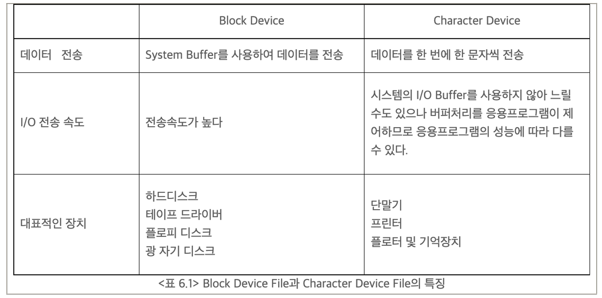

- SW사관학교 정글 5기 10~13주차 정리
<!-- more -->

## 1. Virtual Memory 관련 모르는 용어 정리

- 용어 정리
    - 블록디바이스 (Block Device)
        - 하드디스크나 CD/DVD 등의 장치
        - 블록이나 섹터 등의 정해진 단위로 반환
        - I / O 속도가 빠름
        - 다른 종류로 캐릭터 디바이스가 있다.
        
        
        
    - 섹터 (sector)
        - 디스크에서 데이터 한 조각의 단위를 말한다.
    - 스왑 파티션 (SWAP)
        - 메모리(RAM)가 초과하였을때 필요

## 2. 과제 설명서 요약

- Introduction
    - 무한한 메모리를 빌드하여 제한을 풀기
    - 프로젝트 2를 이어서 시작
- Background
    - Source Files
        - `vm` 디렉토리에서 작업
        - `Makefile`은 건들지 말고 바꾸지 말라는 코드는 바꾸지 말것
    - `include/vm/vm.h`, `vm/vm.c`
        - 가상메모리의 기본적인 인터페이스 제공
        - 헤더파일에서는 가상 메모리 시스템이 지원해야 하는 `vm_type` 정의
            - VM_UNINIT
            - VM_ANON
            - VM_FILE
        - 보조 페이지 테이블 구현
    - `include/vm/uninit.h`, `vm/uninit.c`
        - vm_type = `VM_UNINIT` : 초기화되지 않는 페이지들을 위한 기능 제공
        - 현재 모든 페이지가 초기화 되지 않은 페이지로 설정
        - 이후 `anonymous page`, `file-backed page`로 변환
    - `include/vm/anon.h`, `vm/anon.c`
        - vm_type = VM_ANON : anonymous page 기능 제공
    - `include/vm/inspect.h`, `vm/inspect.c`
        - 채점을 위한 메모리 검사기능
        - 수정 XXXXXX
    - 작업할 파일은 대부분 vm 경로와 이전 프로젝트에 소개된 파일들
    - `include/devices/block.h`, `devices/block.c`
        - 블록 디바이스로의 섹터기반 읽기/쓰기를 제공
        - 이 인터페이스는 블록 디바이스가 스왑 파티션에서 접근 할 때 사용
        
- Memory Terminology (메모리 용어)
    - Pages
        - 4,096바이트(byte) = 4키비바이트(KiB)
        - 이 길이를 가지는 가상 메모리의 연속된 영역
        - 페이지에 정렬(page-aligned) = **가상주소의 시작부분이 페이지 크기로 나누어 떨어진다.**
            - 64bit 가상주소의 마지막 12bit는 페이지 오프셋
        - 상위 bit는 페이지테이블의 인덱스를 표시하기 위해 사용
        - 64bit시스템은 4가지 페이지 테이블 사용
        
        ```html
        63          48 47            39 38            30 29            21 20         12 11         0
        +-------------+----------------+----------------+----------------+-------------+------------+
        | Sign Extend |    Page-Map    | Page-Directory | Page-directory |  Page-Table |    Page    |
        |             | Level-4 Offset |    Pointer     |     Offset     |   Offset    |   Offset   |
        +-------------+----------------+----------------+----------------+-------------+------------+
                      |                |                |                |             |            |
                      +------- 9 ------+------- 9 ------+------- 9 ------+----- 9 -----+---- 12 ----+
                                                  Virtual Address
        ```
        
        - 프로세스는 `KERN_BASE` (0x8004000000) 미만의 가상주소값을 갖는 독립적인 유저(가상)페이지 집합
            - ↔  커널(가상)페이지 집합은 전역적, 어떤 것이 프로세스가 실행 되어도 같은 위치
    - Frames
        - 물리 프레임 = 페이지 프레임 = 페이지
        - 물리 메모리 상의 연속적인 영역
        - 페이지와 동일한 프레임 페이지 사이즈, 페이지 크기에 정렬
        - 64bit 물리 주소는 프레임 넘버와 프레임 오프셋으로 나누어짐
        
        ```html
                                  12 11         0
            +-----------------------+-----------+
            |      Frame Number     |   Offset  |
            +-----------------------+-----------+
                      Physical Address
        ```
        
        - x86-64 시스템은 물리주소에 있는 메모리에 직접 접근방식이 아님
        - Pintos는 커널 가상 메모리를 물리 메모리에 직접 매핑
        
		>[!info]
        >커널 가상 메모리를 통하면 프레임들에 접근할 수 있다.

    - Page Tables
        - 페이지를 프레임으로 변환 하기위해 사용하는 자료구조(CPU가 가상주소 → 물리주소)
        - 페이지 테이블 포맷은 x86-64 아키텍쳐에 의해 결정
        - `thread/mmu.c` 페이지 테이블 관리 코드 제공
        
        ```c
        // 페이지 테이블은 페이지 넘버를 프레임 넘버로 변환하며, 
        // 물리주소를 획득하기 위해서 수정되지 않는 오프셋과 결합
                                   +----------+
                  .--------------->|Page Table|-----------.
                 /                 +----------+           |
                |   12 11 0                               V  12 11 0
            +---------+----+                         +---------+----+
            | Page Nr | Ofs|                         |Frame Nr | Ofs|
            +---------+----+                         +---------+----+
             Virt Addr   |                            Phys Addr    ^
                          \_______________________________________/
        ```
        
    - Swap Slots
        - 스왑 파티션 내의 디스크 공간에 있는 페이지 크기의 영역
        - 페이지 크기에 정렬하는 것이 좋다.
- Resource Management Overview(자원관리 개요)
    
    > 자료구조들을 설계하고 구현해라
    > 
    > - Supplemental page table(보조 페이지 테이블)
    >     - 페이지 테이블을 보조하여 페이지 폴트(page fault) 핸들링이 가능 하도록
    >     - 아래 보조페이지 테이블 관리 부분 참고
    > - Frame table
    >     - 물리프레임의 퇴거 정책(eviction policy)을 효율적으로 구현
    >     - 아래 프레임 테이블 관리 부분 참고
    > - Swap table
    >     - 스왑 슬롯이 사용되는 것을 추적
    >     - 아래참고
    
## 구현
양이 많아 노션에 정리한 링크로 대체

[Part 1 : Memory Management](https://www.notion.so/Part-1-Memory-Management-92ac10e50f3648d488f1ecbeb60b2784?pvs=21)

[Part 2 : Anonymous Page & Lazy Loading](https://www.notion.so/Part-2-Anonymous-Page-Lazy-Loading-7232044531804c24802c084ee42ac660?pvs=21)

[Part 3 : Stack Growth](https://www.notion.so/Part-3-Stack-Growth-064f6aa6965843669acfb3507ebf6c79?pvs=21)

[Part 4 : Memory Mapped Files(File Backed Mapping)](https://www.notion.so/Part-4-Memory-Mapped-Files-File-Backed-Mapping-921f8ebd2fdf45a9a3896ffed982b7f4?pvs=21)

[Part 5 : Swap In/Out(작성중)](https://www.notion.so/Part-5-Swap-In-Out-394937cac7324bc0bc9407cf1aa47fea?pvs=21)